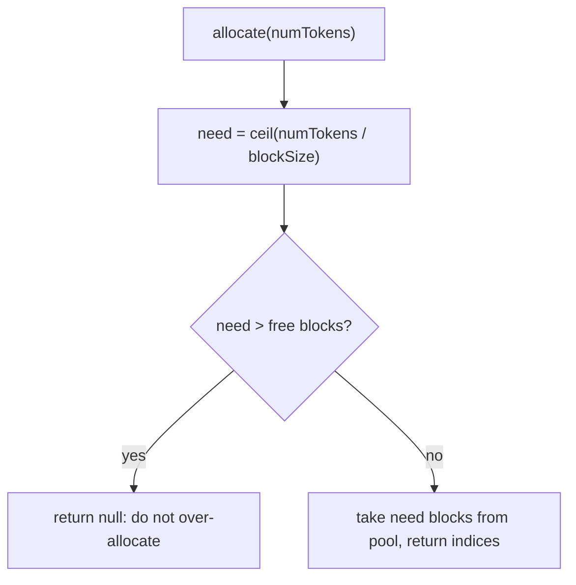

# Build it: a paged KV allocator

## Why fixed-size blocks

The KV cache grows one entry per generated token, and you don't know a sequence's final length in
advance. If you allocate each sequence a single **contiguous** region, memory fragments: freed gaps
are the wrong size for the next request, and you waste capacity you can't use. This is the exact
problem **paged attention** solves.

The idea, borrowed from OS virtual memory: chop KV memory into **fixed-size blocks** and let a
sequence's blocks be **non-contiguous**, tracked by a block table. To hold `N` tokens with block size
`B` you need `ceil(N / B)` blocks — the ceiling, because a partly-filled block still occupies a whole
block. Because every block is the same size, a freed block can serve *any* future request, so there
is no **external fragmentation**.

## Allocating and freeing blocks

Keep a pool of free block indices. Two operations:

- **allocate(numTokens):** compute `need = ceil(numTokens / blockSize)`. If `need` exceeds the number
  of free blocks, **return `null`** — you must *not* over-allocate; handing out memory you don't have
  is how a server OOMs. Otherwise take `need` blocks from the pool and return their indices.
- **free(blockIds):** return those indices to the pool so they can be reused.

Two invariants make it correct: allocations that are live at the same time must **never share a
block** (that would corrupt one sequence's KV with another's), and every allocated block must come
back on `free`. Get those right and, thanks to the uniform block size, the allocator never
fragments — the property that lets a server pack far more concurrent sequences into the same memory.
