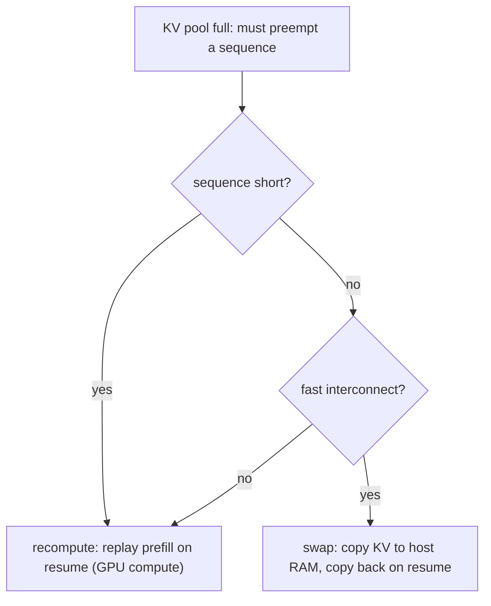

# KV cache — eviction under memory pressure

## Preemption: recompute vs. swap

Even with paging, a busy server eventually runs out of KV memory. When it does, it must **preempt** a
running sequence — pause it and reclaim its KV blocks so other requests can make progress. The paused
sequence's cache has to be restored later, and there are two standard ways to do it:

- **Recompute** — throw the KV away now, and when the sequence resumes, rebuild its K/V from the
  original tokens by replaying the prefill. This costs **GPU compute**.
- **Swap** — copy the KV out to **host (CPU) memory** now, and copy it back when the sequence
  resumes. This costs **PCIe / host-memory bandwidth**, but avoids redoing any work.

## Choosing a strategy

Neither strategy wins everywhere; the choice depends on sequence length and hardware:

- **Recompute** is cheap for **short** prefixes — replaying a few hundred tokens is fast, and it frees
  memory immediately without touching the interconnect.
- **Swap** shines for **long** sequences on fast interconnects — moving bytes over PCIe beats
  recomputing thousands of tokens of attention, as long as the bandwidth is there.

The rule of thumb: short sequences favor recompute (compute-bound and cheap), long sequences with a
fast link favor swap (bandwidth-bound but avoids the redo). A scheduler under mixed load picks per
sequence, evicting lower-priority work first.

Eviction matters because it is the server's last line of defense when the KV pool fills: choosing
recompute versus swap well keeps sequences making progress under pressure instead of failing outright.
