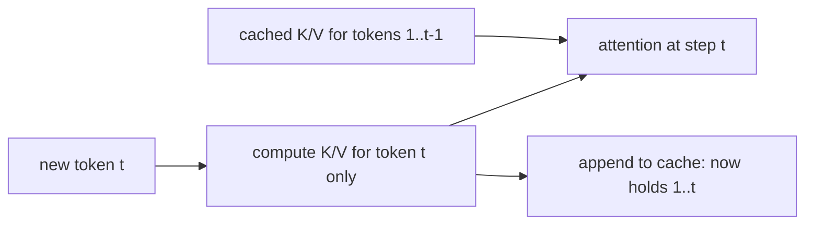

# KV cache — what it is and how to size it

## What the KV cache is

During autoregressive decoding, attention at step *t* needs the **keys** and **values** of every
previous token, at every layer. Recomputing them from scratch each step would make generation
**quadratic** in sequence length. Instead the server caches them: the **KV cache** holds the K and V
tensors for all past tokens, per layer, so each new step only computes K and V for the *one* new
token and reuses the rest.

Each decode step reuses the whole existing cache, computes K/V for just the new token, and appends
it — so the cache grows by one token's worth of K/V every step:



That cache is not free. It is the reason serving deployments run out of memory:

- **Weights** are a *fixed, one-time cost*. You load them once and every request shares them.
- **The KV cache is per request.** Every active sequence carries its own K/V tensors, and they grow
  with every token generated.

At load, the sum of every request's KV cache dwarfs the weights. So the KV cache — not the model —
is usually what caps how many requests you can run **concurrently**. Capacity planning that budgets
only weights (and ignores KV per token) will OOM the moment real traffic arrives. Alongside KV, the
other memory consumers to remember are the **weights** themselves and transient **activations**.

## Sizing the KV cache

For a fixed architecture and dtype, KV memory for one request is **linear in sequence length**: twice
the tokens, twice the KV. The full estimate multiplies out the tensor shapes:

```
KV bytes = 2 (one K, one V)
         x num_layers
         x num_heads
         x head_dim
         x seq_len
         x bytes_per_element   (FP16 = 2, INT8 = 1)
```

A worked example — layers=32, heads=32, head_dim=128, seq_len=1024, FP16:

```
2 x 32 x 32 x 128 x 1024 x 2 = 536,870,912 bytes  (~0.5 GB) for a single sequence.
```

Two levers fall straight out of the formula:

- **Sequence length** is the term that varies per request, and it scales KV **linearly** — long
  contexts are what throttle concurrency.
- **bytes_per_element** is set by the dtype. Quantizing KV from FP16 (2 bytes) to INT8 (1 byte)
  roughly **halves** KV memory, buying more context or more concurrency at some quality risk.

This sizing arithmetic matters because it is long contexts and dtype choices — not the weights — that
decide how many requests a server can hold at once; get the number wrong and you OOM under real traffic.
