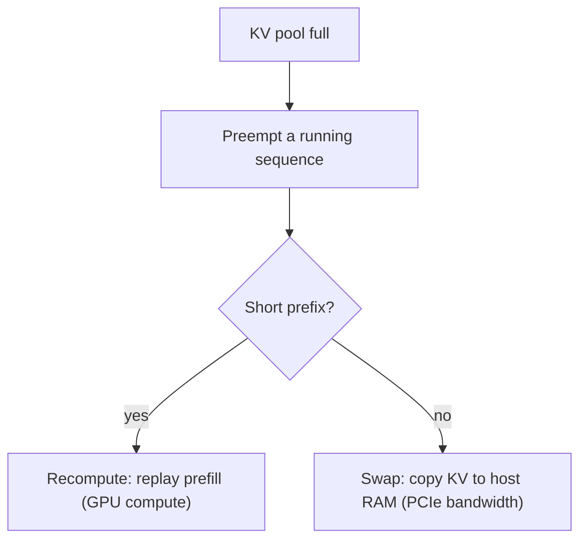

# KV cache management — eviction roadmap

## Roadmap: eviction under memory pressure

**What this section covers.** What a busy server does when even a paged KV pool fills up: it
preempts a running sequence and later restores its cache, choosing between two strategies that trade
GPU compute against interconnect bandwidth.

**The ideas you'll meet:**

- **Preemption** — pausing a running sequence and reclaiming its KV blocks so other requests can make progress.
- **Recompute** — discard the KV now and rebuild it by replaying prefill on resume; costs GPU compute.
- **Swap** — copy the KV out to host (CPU) memory now and copy it back on resume; costs PCIe / host-memory bandwidth.
- **Strategy choice** — short prefixes favor recompute; long sequences on a fast interconnect favor swap.

**Why it matters.** Eviction is the server's last line of defense when the pool fills — choosing
recompute versus swap well keeps sequences making progress under pressure instead of failing outright.
