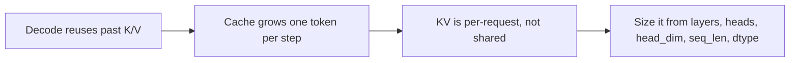

# KV cache management — memory & sizing roadmap

## Roadmap: memory and sizing the KV cache

**What this section covers.** Why serving deployments cache the keys and values of past tokens
at all, and why that per-request cache — not the model weights — is what caps how many sequences a
server can run at once. You'll learn to size it straight from the tensor shapes.

**The ideas you'll meet:**

- **KV cache** — the stored keys and values for all past tokens, per layer, so each step computes K/V for only the one new token.
- **Quadratic vs. linear** — recomputing K/V every step would be quadratic in sequence length; caching makes decode linear.
- **Per-request cost** — weights load once and every request shares them; each active sequence carries its own growing KV.
- **KV sizing formula** — `2 x layers x heads x head_dim x seq_len x bytes_per_element` gives the bytes for one sequence.
- **Sequence-length lever** — the term that varies per request; KV scales linearly with context, so long prompts throttle concurrency.
- **dtype / quantization lever** — `bytes_per_element` (FP16 = 2, INT8 = 1); halving it roughly halves KV memory.

**Why it matters.** Capacity planning that budgets only weights and ignores per-token KV OOMs the
moment real traffic arrives — sizing the cache is the first thing that separates engineers who have
served models from those who have only called them.
