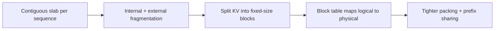

# KV cache management — paging & fragmentation roadmap

## Roadmap: paging and fragmentation

**What this section covers.** Why storing each sequence's KV in one contiguous slab wastes memory,
and how paged attention — the operating-systems paging idea applied to the KV cache — packs many
sequences into the same pool, eliminates fragmentation, and unlocks prefix sharing.

**The ideas you'll meet:**

- **Internal fragmentation** — reserving room for the max length but using little; the gap between reserved and used is dead memory.
- **External fragmentation** — scattered freed gaps mean a large request won't fit even when total free memory is plenty.
- **Paged attention** — vLLM-style storage of the KV cache in fixed-size, non-contiguous blocks.
- **Block table** — a per-sequence map from logical token positions to physical KV blocks, like an OS page table.
- **`ceil(N / B)` blocks** — a partly-filled block still occupies a whole block, so `N` tokens need the ceiling.
- **Prefix sharing** — two sequences with the same prompt prefix point their block tables at the same physical blocks, computed once.

**Why it matters.** Because KV capacity is what caps concurrency, packing sequences tightly instead
of reserving worst-case slabs is what converts wasted HBM back into requests you can actually serve.
