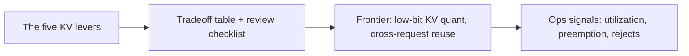

# KV cache management — design review & frontier roadmap

## Roadmap: design review and the frontier

**What this section covers.** Zooming out from individual mechanisms to the whole design space: the
levers a systems engineer pulls, how to critique a KV design the way an interviewer would, where the
research frontier is heading, and which signals you watch once it's live in production.

**The ideas you'll meet:**

- **The five levers** — layout, attention sharing (MHA/GQA/MQA), precision, placement, and reuse.
- **Common, SOTA, antipattern** — a ladder for judging how mature a KV design is.
- **Design-review checklist** — where the capacity number comes from, contiguous vs. paged, per-tenant caps, and the pressure policy.
- **Low-bit KV quantization** — pushing below FP16 (KIVI, KVQuant) despite the channel-wise outliers that live in the keys.
- **Cross-request KV reuse** — RadixAttention / SGLang sharing prefixes across requests via a radix tree with LRU eviction.
- **Ops signals** — KV pool utilization, preemption / eviction rate, admission rejects, and average context length.
- **KV as scheduling currency** — reasoning about serving capacity in KV tokens, not requests.

**Why it matters.** This is the senior-engineer view: naming each lever, what it costs, and the regime
where it wins is exactly what reads as depth in a design review or an interview.
