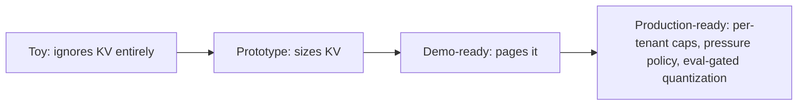

## Reviewing a KV cache design

**In brief.** Every KV decision is really one decision: how many concurrent sequences fit in a fixed
pool of HBM, and at what latency and quality cost. Reviewing a design — in a doc or an interview —
means walking five levers, naming what each one costs, and rating how far the design still is from
production.

**The five levers.**

- **Layout** — contiguous per-sequence buffers versus paged fixed-size blocks. Contiguous is simple and cache-friendly but forces you to reserve `max_seq_len` up front, so internal fragmentation wastes most of the pool: reserving 8192 tokens when the average request generates ~600 throws away roughly 90% of the HBM you paid for, and you serve a handful of users. Paging allocates blocks on demand, cutting waste to at most one partial block per sequence.
- **Attention sharing** — MHA versus GQA versus MQA. Grouped-query and multi-query attention shrink the number of KV heads, a direct multiplier on KV bytes: 32 KV heads down to 8 (GQA) quarters the cache, and MQA (1 KV head) is an 8x cut versus that GQA config. The single biggest structural lever — but it is chosen at training time, not serving time.
- **Precision** — KV quantization (fp16 to int8/fp8, or int4 for the cache). Halving the KV dtype roughly doubles the sequences you can hold, at some quality risk on long contexts.
- **Placement** — keep KV in HBM, offload cold blocks to host RAM or NVMe, or recompute on demand. Offload buys capacity at the cost of PCIe bandwidth and tail-latency spikes on cold blocks.
- **Reuse** — prefix sharing with copy-on-write: requests with the same system prompt point at the same KV blocks. If 1,000 requests share a 2,000-token system prompt, naive serving pays that KV a thousand times; sharing pays it once.

**The review checklist.**

- **Where does the capacity number come from?** If it counts weights and not per-token KV, stop there — the plan will OOM. Weights are a fixed one-time cost shared by every request; concurrency is KV-bound, roughly `KV_pool_bytes / bytes_per_sequence`, and `bytes_per_sequence` grows linearly with context. Leftover HBM minus weights is **not** the servable capacity.
- **Contiguous or paged?** Contiguous reservation in a multi-tenant server is an immediate flag. Note that lowering `max_seq_len` only truncates long requests, and switching the buffer to int8 shrinks the footprint without fixing the fragmentation — the fix is blocks allocated on demand.
- **What caps a single sequence?** No per-request or per-tenant KV cap means one long context starves everyone — a head-of-line problem.
- **Any precision or sharing wins left on the table?** GQA/MQA chosen, KV quantization considered and evaluated, shared prefixes deduplicated?
- **What happens under pressure?** A real design names its eviction and admission policy and what the user experiences when the pool is full — queue, reject, or degrade — never "it just works."

**Antipatterns and the eval gate.**

- **Weights-only capacity planning** — budgeting from the weights and ignoring per-token KV. It passes a demo and OOMs the moment real, long traffic arrives.
- **Reserving `max_seq_len` contiguously "to be safe"** — prototype-grade in any multi-tenant server.
- **No per-tenant cap** — a single long-context request monopolizes the pool.
- **Quantizing KV with no eval** — the concurrency win from int8 KV is real and roughly linear, but quantization error **compounds over long contexts**. Validating on short prompts only is exactly where a silent long-context regression slips through. The fix is a long-context quality eval as a gate, not banning quantization: naming the quality risk and the eval you would run is what separates depth from "just quantize the KV cache."

**The prior art, and the interview signal.**

- **PagedAttention (vLLM, Kwon et al., 2023)** — introduced storing the KV cache in fixed-size, non-contiguous blocks tracked by a block table, eliminating the external fragmentation that capped concurrency. Paged KV is now table stakes. This is the system to name for paging; **FlashAttention** (Tri Dao, 2022) is the IO-aware attention kernel underneath — it cuts attention's memory traffic and is distinct from KV storage.
- **RadixAttention (SGLang)** — extended the idea with a prefix tree so common prompt prefixes share KV blocks across requests.
- **The lead answer** — asked to design a serving memory manager, lead with paged blocks plus a block table, then prefix sharing, then an SLO-aware eviction policy, and name vLLM/PagedAttention as the prior art.
- **The signal itself** — the KV question that most separates experienced candidates is computing KV memory from the shapes and explaining why long contexts throttle concurrency. That one calculation is what distinguishes people who have served models from people who have only called them. Red flags that sink candidates: proposing contiguous allocation, ignoring KV in capacity planning, or treating context length as free.

**Why it matters.** Naming each lever, what it costs, and the regime where it wins places any KV design
on the toy → prototype → demo-ready → production-ready ladder in minutes — and it is exactly what reads
as senior in a design review or an interview.
