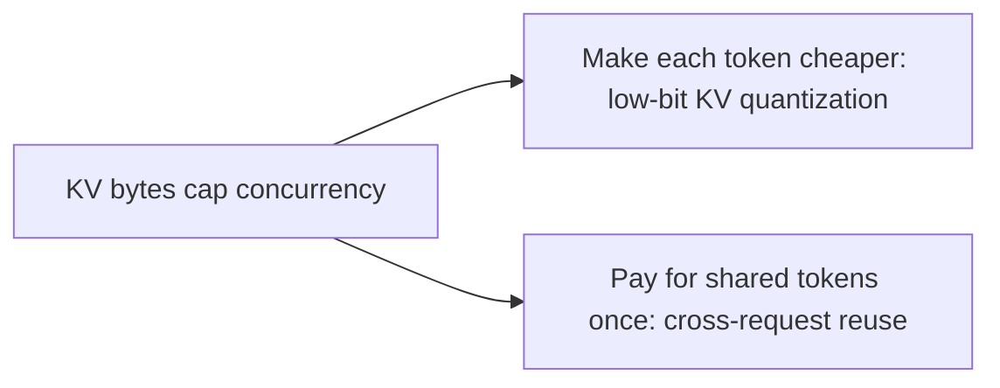

## The frontier & operating a live KV pool

**In brief.** The research edge and the production dashboard attack the same bottleneck — KV bytes cap
concurrency — from two sides. The frontier either makes each token cheaper or pays for shared tokens
once; operations watch a handful of signals that say whether the pool is healthy and where the next
capacity wall is.

**Where the frontier is.**

- **Low-bit KV quantization** — halving the KV dtype roughly doubles the sequences you can hold, so the race is to go below fp16 without wrecking long-context quality. The load-bearing finding across this line of work (KIVI, KVQuant, and successors) is that the **keys carry channel-wise outliers** — a few channels have very large magnitudes — and those outliers are what make naive uniform low-bit quantization fall apart. The techniques differ in how they handle it: **KIVI** quantizes keys **per-channel** (and values per-token) to isolate the outlier channels; **KVQuant** uses **non-uniform** quantization so the few large values keep resolution. The capacity is real, but the win is gated by a long-context eval — "just int4 the cache" without outlier handling is the classic way to ship a silent regression.
- **Cross-request KV reuse** — vLLM's PagedAttention shares a prefix within copy-on-write blocks; the frontier generalizes this to automatic reuse **across** requests. **SGLang's RadixAttention** keeps every request's KV in a **radix tree** (edges are token sequences) with an **LRU eviction policy**, so any new request that shares a prefix with a past one reuses those blocks — cutting prefill compute and TTFT. On workloads with high prefix overlap (shared system prompts, few-shot templates, multi-turn chat) this turns a per-request cost into a near-free cache hit. The mental model: the KV cache is becoming **cluster-level state**, not per-replica scratch.
- **Which lever a workload should reach for** — the two directions attack the same bottleneck from different angles, so match the lever to the distinguishing feature. A workload defined by a large **shared** prefix (thousands of requests, one long system prompt) wants **reuse** first: pay for the shared tokens once. Quantization also helps, but it makes each token cheaper without exploiting the sharing, and no lever "always dominates." Reverting GQA to full multi-head attention or disabling paging to save bookkeeping both make KV pressure strictly **worse**.

**Signals to watch in production.**

- **KV pool utilization (% of blocks allocated)** — the headline gauge. Sustained utilization near 100% means you are one traffic spike from preemption; chronically low means you over-provisioned HBM.
- **Preemption / eviction rate** — how often the scheduler evicts or recomputes a running sequence's KV under pressure. This is the **leading indicator** that the pool is too small for the offered load: it shows up as tail-latency spikes **before** it shows up as errors, which is why it beats lagging or irrelevant signals for early warning.
- **Admission rejects and queue depth** — requests refused or waiting because there are not enough free blocks to admit them. This is the "capacity exceeded" signal and should drive autoscaling; it is the next signal after preemption.
- **Average context length and its trend** — concurrency is roughly the pool divided by bytes-per-sequence, and bytes-per-sequence grows with context. A creeping average context silently halves effective concurrency **even at a constant request rate** — nothing about the model changed, and the weights did not grow; the same fixed pool simply holds fewer sequences. Capacity planning must track it, not just request rate.

**Why it matters.** Alert on preemption rate and admission rejects (the leading indicators),
capacity-plan on utilization and average context length, and never reason about serving capacity in
"requests" when the real currency is **KV tokens**.
