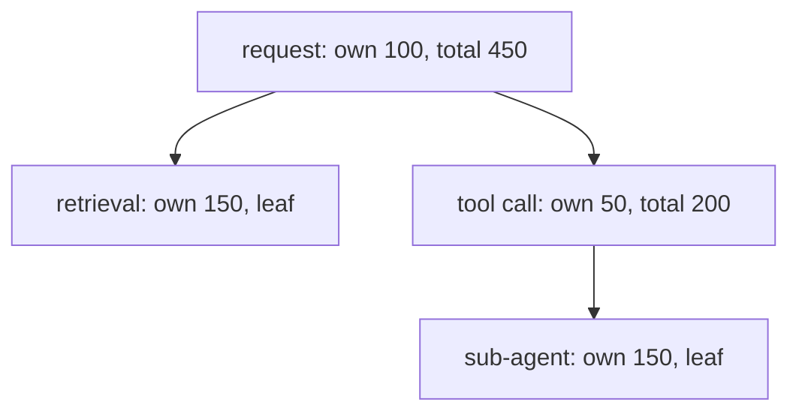

# Build it: rolling up tokens over a trace

## Spans form a tree

A trace of a multi-step LLM request is a **tree of spans**: the top-level request contains child
spans (a retrieval call, a tool call, a sub-agent), each of which may contain its own children. Every
span records its own **tokens** (and latency, and cost).

To answer "how many tokens did this request use?" you **roll up** the tree: a span's total is its
**own** tokens **plus** the rolled-up totals of all its children, recursively. A **leaf** span (no
children) totals just its own tokens. The same recursion gives you latency and cost rollups.

## Why request-level counters aren't enough

You could keep a single top-level token counter — but it hides *where* the tokens went. Was it the
retrieval? The reranker? A runaway sub-agent? For an agentic system, a flat number is nearly useless
for debugging or cost attribution.

The span tree plus rollup lets you attribute tokens/latency/cost to **each step**, then aggregate up
to the request. That per-step attribution — not just a request total — is exactly why observability
for multi-step LLM systems is a tree, and why "just log the total tokens" doesn't cut it once there's
more than one call in the request.
