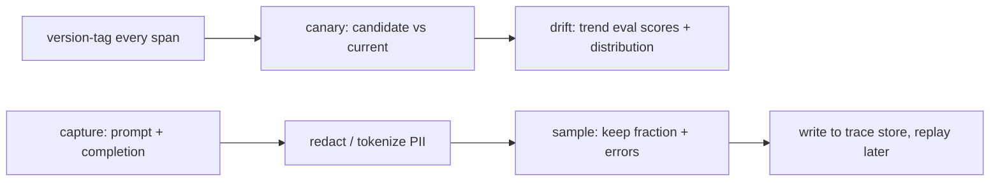

# LLM observability — change safety roadmap

## Roadmap: drift, canaries, capture and replay

**What this section covers.** The regressions that never throw an error — **drift** in quality or
input distribution — and how **version tags** plus a **canary release** catch them, alongside
**capture/replay** for reproducing a specific failure without hoarding raw user data.

**The ideas you'll meet:**

- **Drift** — a gradual change in output quality or input distribution over time, even when the code never changed; error counters stay green throughout.
- **Canary release** — route a small slice of live traffic to a candidate version and compare its signals side by side before promoting it.
- **Version tagging** — tag every span with prompt/model version so canary and drift comparisons are even possible.
- **Capture/replay** — store the actual prompts and completions so a failing run can be reproduced deterministically and stepped through.
- **Sampling** — keep a fraction of traces plus all errored ones, to control volume and cost.
- **Redaction** — remove or tokenize PII *at capture time*, before the payload is written to the trace store.

**Why it matters.** A mature product's worst failures degrade quality silently; this section is how you
see them coming and still keep a debuggable trace without turning capture into a privacy leak.
