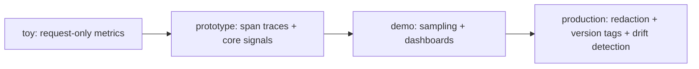

# LLM observability — reviewing & operating roadmap

## Roadmap: reviewing and operating at the frontier

**What this section covers.** How an engineer *judges* an observability design and *runs* it in
production — the levers and their tradeoffs, the maturity ladder from toy to production-ready, the
operational signals you watch when it's live, and the standards and tools that define the field.

**The ideas you'll meet:**

- **Design levers** — trace granularity, signal richness, sampling, payload capture, and change safety; each one buys something and costs storage, cardinality, or privacy.
- **Common → SOTA → antipattern** — the ladder for judging any subsystem: what ships everywhere, what to reach for under pressure, and what fails in production.
- **OTel GenAI semantic conventions** — the emerging vendor-neutral standard for how GenAI traces and spans are structured; still stabilizing, so pin a version.
- **Tail sampling** — always keep errored/slow/expensive traces, sample the rest, to cut volume without losing the interesting ones.
- **Operating signals** — trace/span coverage, per-route token/cost/latency rollups, PII-leak rate, and drift-alert rate.
- **The tools** — Langfuse, LangSmith, Arize/Phoenix, Helicone, and OpenLLMetry: the trace stores and dashboards that implement this.
- **Interview red flags** — request-only metrics for agents, logging raw PII, and shipping changes with no version tags.

**Why it matters.** Naming a lever, what it costs, and the regime where it wins is exactly the depth an
interviewer and a design review probe for — and the operating signals are what keep a live system's
telemetry trustworthy, affordable, and safe.
