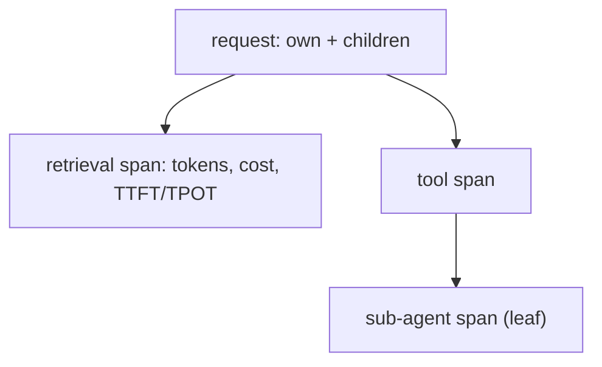

# LLM observability — core signals roadmap

## Roadmap: the core signals and rollups

**What this section covers.** The small, consistent set of signals every span should carry — tokens,
latency, errors, cost — the **TTFT/TPOT** split that keeps latency honest, and how those signals
**roll up** the span tree so you can attribute speed and spend to each step, then to the whole request.

**The ideas you'll meet:**

- **Core signals** — tokens (in/out), latency, errors/retries, and cost, recorded per span rather than only per request.
- **TTFT — Time To First Token** — time until the first token streams back; captures prefill and queueing.
- **TPOT — Time Per Output Token** — the steady-state per-token decode time after the first token.
- **Cost** — `input_tokens × in_price + output_tokens × out_price`, summed up the trace.
- **Rollup** — a span's total is its own signals plus its children's totals, recursively; a leaf span totals just its own.
- **Percentiles (p95/p99)** — tail latency, which users actually feel, matters more than averages.

**Why it matters.** Cheap structured signals on every span are what let rollups answer "which step is
slow or expensive?" after the fact, instead of guessing from a single aggregate number.
