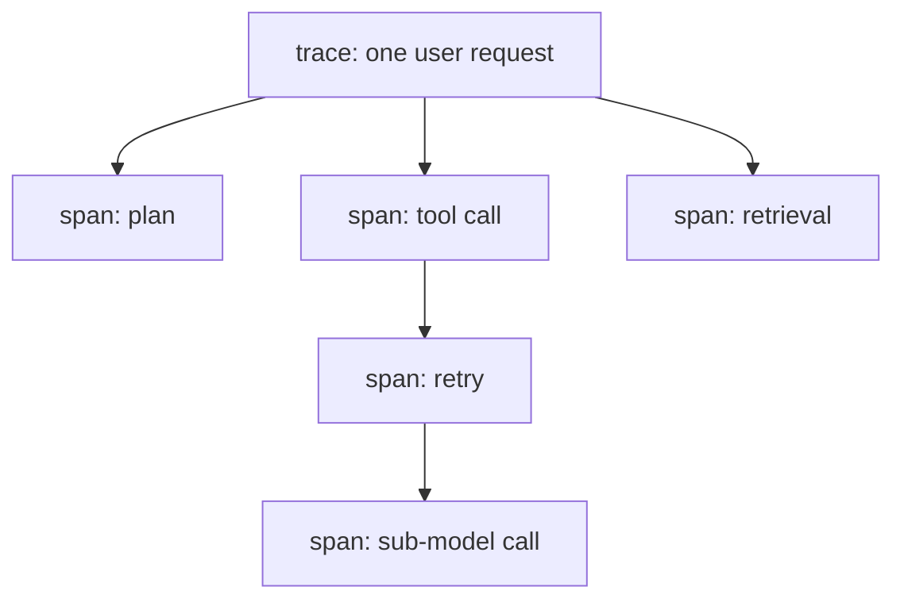

# LLM observability — traces & spans roadmap

## Roadmap: traces and spans

**What this section covers.** Why a single request-level timer is blind to an agent, and how a
**trace** built from nested **spans** and threaded by a **correlation ID** turns one request's fan-out
into a structure you can actually follow step by step.

**The ideas you'll meet:**

- **Fan-out** — how one agent request explodes into planning, tool calls, retrieval, retries, and sub-model calls; the reason request-only metrics hide *where* time, tokens, and cost went.
- **Trace** — the end-to-end record of one request.
- **Span** — one unit of work (a model call, tool call, or retrieval) with its own timing and signals; spans nest into a tree over the call graph.
- **Correlation ID (trace ID)** — threaded through every step and service so the spans they emit stitch back into a single trace, even across process boundaries.

**Why it matters.** Everything else in observability — the signals, the rollups, drift, and
capture — rides on spans stitched by a correlation ID; without that structure you can see *that* a
request was slow, never *where*.
