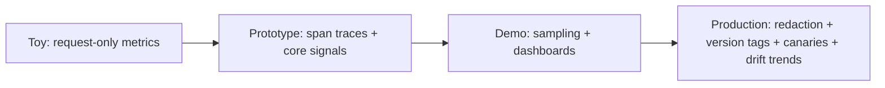

## Reviewing an observability design

**In brief.** Every observability decision is really a decision about how much signal you keep, at what
storage and privacy cost, and how quickly you can answer "which step went wrong" when an agent
misbehaves. Reviewing a design means walking five levers, naming what each one costs, and asking what
the plan still cannot see.

**The five levers.**

- **Trace granularity** — request-only metrics versus span-per-step traces over the whole call graph. An agent turn fans out into planning, tool calls, retrieval, retries, and sub-model calls, so a single request timer collapses all of it into one number: you see **that** a turn was slow, never **where**. Span-level traces following the **OpenTelemetry GenAI semantic conventions**, stitched by correlation IDs, pinpoint the slow or failing step — at the cost of instrumentation effort and cardinality. Reaching for a different aggregate gateway metric is not a fix; the missing thing is structure.
- **Signal richness** — which attributes ride on each span: just a wall-clock timer, or tokens (in/out), latency split into **TTFT** and **TPOT**, errors/retries, and derived cost. Richer signals cost storage and cardinality, and are exactly what make rollups and attribution possible.
- **Sampling** — keep every trace, or keep a fraction plus all errored/slow ones (**tail sampling**). This is where you decide what you can afford to **not** be able to debug later. "Keep everything" does not scale; "keep 1% head-sampled" throws away your errors.
- **Payload capture** — store prompts and completions for replay, or only the numeric signals. Numeric signals per span are tiny; **payloads dominate storage**, so capturing 100% of them is what actually blows the budget. Raw prompts also carry PII, making capture a privacy exposure. The fix is redaction/tokenization at capture time plus tail sampling that keeps full payloads only for errored, slow, or otherwise interesting traces.
- **Change safety** — version-tag every span (prompt/model version) so **canaries** and **drift** trends are even possible. Without tags, a provider model swap silently degrades quality and you cannot correlate the regression to any change. Version tagging is not just cost attribution; it is what turns "did our quality slide?" into a side-by-side comparison.

**The review checklist.**

- Request metrics or real traces? Request-only metrics on an agent is an immediate flag — you cannot debug fan-out you never recorded.
- Are the core signals on each span — tokens, TTFT/TPOT, errors/retries, derived cost?
- What is the sampling policy, and does it keep the errored, slow, and expensive traces?
- How is PII handled — redaction or tokenization at capture time, plus access controls?
- Can you detect a silent regression: version tags, a canary path, and drift trends on eval scores — or does the plan only page on loud errors?

**Antipatterns and the ladder.**

- **Request-only metrics for an agent**, **raw-PII payload logging**, **no version tags**, and alerting only on loud errors while quality drifts unmonitored. Each passes a demo and blinds you exactly when a real incident hits.
- Observability is also **not free latency**: synchronous, blocking export on the request path adds tail latency. The discipline, echoing the **Google SRE** tradition, is to emit spans asynchronously and batch-export, so making a capture write synchronous makes a design worse, not safer.
- Rating follows the checklist: a **toy** has request metrics only; a **prototype** adds span traces with the core signals; a **demo** adds sampling and dashboards; a **production-ready** design also redacts captured PII, version-tags every span, and closes the loop with canaries and drift detection.

**Why it matters.** Naming the lever, what it costs, and the regime where it wins is the interview
answer in miniature — and "just log everything", with no word on the storage blowup, the PII risk, or
the sampling policy, is the tell of shallow depth.
