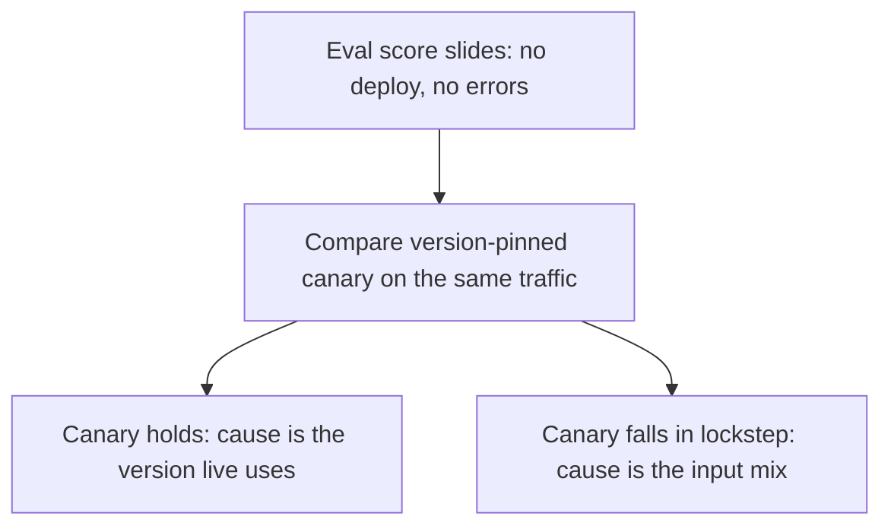

## The frontier: standards, privacy, and silent drift

**In brief.** Tooling solved the easy 80% of LLM observability — spans, correlation IDs, and
token/cost rollups are essentially done. Three problems stay genuinely open: standardized semantics,
privacy-preserving capture, and catching a quality slide that never throws an error.

**The three open problems.**

- **OTel GenAI semantic conventions are still stabilizing.** The bet the field made — that observability should be a portable, vendor-neutral standard rather than every tool inventing its own schema — aged very well, but the standard itself is not frozen. The `gen_ai.*` attribute set (model, tokens, latency, cost, and increasingly agent/tool-call and content-capture semantics) is still largely **experimental**, and its scope keeps growing from single-call tracing toward agent orchestration. Instrument against the conventions to stay portable, but **pin or opt in to a convention version** and expect attribute churn, so a spec bump doesn't silently break your dashboards. Read them as the direction, not the frozen spec.
- **Privacy-preserving traces beyond redaction.** Field-level redaction — masking or tokenizing known PII before it hits the trace store — is the current baseline, but it is brittle: it only catches the PII you thought to **name**, and captured prompts and completions are exactly where sensitive data hides. The frontier moves past field redaction toward **tokenization and pseudonymization at capture time**, and capture that survives an **audit**, not just a demo — keeping a trace debuggable without hoarding raw user text. Capture is a privacy liability, and "we redact the obvious fields" is the classic way to ship a leak the rules never saw. Note the two failure directions this rules out: logging everything raw, and disabling capture so nothing is debuggable.
- **Automated silent quality-drift detection.** The genuinely open one. A quality slide with **no code change** — a provider model swap, a shifting input distribution, or a slowly rotting prompt — never errors, so alerting on loud errors misses all of it. The emerging shape is **eval-gated, canary-anchored** detection: trend eval scores and input/output distribution against a **version-tagged baseline**, rather than trip a single static threshold. Drift is a **trend over a versioned baseline**, and a system that only pages on 5xx errors is blind to the failure mode that actually degrades a mature product.

**Reading a silent slide.**

- The signature is unmistakable once you know it: eval scores fall while error rate, latency, and cost stay flat, with no deploy and no code change. Green error counters prove nothing about quality — by definition nothing else pages when quality slides without an error, so a falling eval score is the alarm, not noise to be dismissed.
- Drift is a change in **output quality or input distribution**, so any diagnosis has to say **which**. The lever that separates them is the **canary**: a small slice of live traffic routed to a version-pinned prompt+model and compared side by side with the current version on the same real inputs. Version-tagging every span is what makes that comparison possible.
- If live drifts while the **pinned canary holds** on the same unchanged inputs, the inputs are exonerated and the cause sits in whatever changed underneath live — classically a provider rotating the model behind a stable API.
- If the **pinned canary falls in lockstep** with live and the input-distribution monitor shows the request mix has shifted, the version is exonerated: the same deterministic prompt+model now faces inputs it handles worse. The response differs too — the swap calls for pinning and version negotiation, the input shift for prompt and coverage work.

**Why it matters.** These three map onto the topic's durable open problems — standardized semantics,
privacy-preserving capture, and quality-drift detection — and the canary comparison is what turns a
falling eval score from a mystery into an attributed cause.
