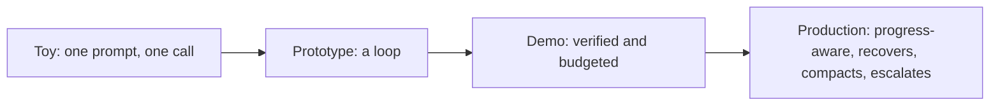

# Loop engineering — architecture, tradeoffs, and reviewing a loop design

You already know the anatomy of a loop, the shapes it can take, and how to keep it making progress and
recovering. This lesson zooms out to the **design space**: the levers a systems engineer pulls when
building an agent loop, what each one trades away, and how to judge someone else's loop design the way
an interviewer or a staff engineer in a review would.

## The loop design space

Every loop decision is really a decision about **how much autonomy you grant the model versus how much
reliability the surrounding code guarantees** — at some latency and cost. There are five largely
independent levers, and real loops combine them:

- **Loop shape** — a single bounded loop, plan-then-execute, reflect-and-retry, the edit-run-observe
  coding loop, or a search loop. The most-constrained-shape rule governs the choice.
- **Progress and verification** — what counts as measurable progress, and whether each step is verified
  against a real signal before the next. The strength of the check is a dial: none, a self-review, or a
  deterministic gate (run the tests).
- **Termination and bounding** — step/token/time budgets, no-progress and oscillation detection, and
  named stop reasons. This is the lever that separates an agent from "an infinite loop with an API key."
- **State management** — what carries across iterations and how it's kept legible: raw accumulation
  versus deliberate compaction of stale observations.
- **Recovery policy** — what a failure becomes: a crash, a blind retry, or a classified next action
  (retry transient / re-plan the approach / escalate).

## A tradeoff table for loop engineering

| Strategy | Buys you | Costs you | Reach for it when |
|---|---|---|---|
| Single bounded loop | Simple, cheap, one legible trace | One reasoning thread; no parallelism | Most agent tasks |
| Plan-then-execute | Each step checkable and re-plannable | Planning latency and orchestration code | Multi-step tasks where steps can fail and recover |
| Reflect-and-retry | Learns from a failed attempt instead of repeating it | An extra reasoning turn per retry | Failures that are actually informative |
| Deterministic step verification | Real progress; no drift on false beliefs | Test/run latency per step; must build the check | Any mutating or coding loop |
| Compaction | Sustains long-horizon runs | A summary can drop a detail you needed | Loops that run long enough to bloat context |
| Tree/graph search | Explores multiple viable paths | Multiplies model calls and coordination | Tasks that genuinely branch and are scorable |

The table is the interview answer in miniature: **name the lever, name what it costs, name the regime
where it wins.** A candidate who reaches for multi-agent search to "fix" a loop that just needs a
budget and a verify step is signalling shallow depth.

## Common, SOTA, and antipattern

A useful way to hold the whole topic is the **common → SOTA → antipattern** ladder.

- **Common (works, ships everywhere):** a single bounded edit-run-observe loop with a step/token
  budget, tests-as-verification after each edit, and named stop reasons. A perfectly good default.
- **SOTA (frontier, worth reaching for under real pressure):** that loop plus plan-then-execute for
  long-horizon tasks, reflect-and-retry so a failed attempt is critiqued not repeated, deliberate
  compaction to survive length, and a real recovery policy — the pattern behind SWE-agent-style coding
  harnesses. The frontier here is reliable long-horizon autonomy.
- **Antipattern (looks fine, fails in production):** an **unbounded** loop whose only exit is the model
  declaring victory; trusting **unverified** progress; **blind-retrying** a permanent failure until the
  budget is gone; and never compacting, so a long run drowns in its own history. Each passes a demo and
  then spins, thrashes, or runs away the bill under real traffic.

## Scaling, length, and the token budget

The specifics that make this concrete:

- **Cost and latency scale with loop length.** Each iteration is at least one model call plus a tool
  round-trip, and the context grows every turn. A task that takes 3 iterations and one that takes 30
  differ by ~10x in tokens and wall-clock — so a step/token budget is a hard cap on both bill and
  latency, not a nicety.
- **The context is the running budget.** Every observation you carry forward is re-sent and re-billed
  on the next call; long tool outputs can dominate. Compaction is a real performance lever, and an
  uncompacted long loop spends most of its budget re-reading itself.
- **Verification adds latency but bounds risk.** Running the tests after each edit costs seconds, but
  it converts a plausible-looking claim into a checked fact. Skipping it is faster and is exactly how a
  loop drifts.

## Reviewing a loop design

When you are handed a loop design to critique — in a review or an interview — walk the same checklist:

1. **What shape, and is it the most constrained that works?** Reaching for search or multi-agent when a
   single bounded loop would do is a red flag.
2. **What counts as progress, and is each step verified before the next?** No verification means the
   loop can drift on a false belief.
3. **What bounds the loop?** No budget, no no-progress detection, or no named stop reason is an
   immediate flag — that is an unbounded loop.
4. **What is the recovery policy?** A design that blind-retries every failure will thrash on permanent
   ones; recovery must classify and re-plan or escalate.
5. **Does state stay legible over length?** A long-horizon loop with no compaction eventually loses the
   thread and the budget.

Rating a design as **toy / prototype / demo-ready / production-ready** comes down to how many of these
it answers. This checklist is the reusable lens a review or interview rewards: it places any loop on
the ladder in minutes and names the one lever that would move it up.
