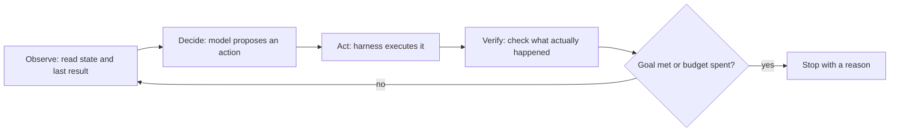

# Loop engineering — anatomy of an agent loop roadmap

## Roadmap: anatomy of an agent loop

**What this section covers.** The loop is the unit of agent design. A single model call answers once;
an **agent** runs a loop — observe the world, decide an action, act, verify the result, repeat — until
a goal is met or the loop is stopped. This section is what that cycle is made of, and why termination
is a first-class output rather than an afterthought.

**The ideas you'll meet:**

- **The loop is the unit** — you design agents by designing loops, not by writing one bigger prompt.
- **Observe, decide, act, verify** — the four phases of every iteration; the model owns only **decide**, the harness owns the rest.
- **Loop vs. pipeline** — a pipeline runs fixed steps once; a loop repeats a variable number of times chosen at runtime from what it observes.
- **Loop state** — what carries across iterations (goal, history, scratchpad, last result), which must be **managed**, not just accumulated.
- **Termination is an output** — every loop must end for a named reason (done, budget, no-progress); a loop whose only exit is the model saying "done" is unbounded.

**Why it matters.** Everything later — loop shapes, progress and recovery, bounding — assumes this
cycle. Get the anatomy right and an agent **finishes**; get it wrong and you have "an infinite loop
with an API key."

**See also.** [harness-engineering] treats the primitive loop and its guards; this topic goes deeper on
engineering the loop as a system. [agent-guardrails-budgets] owns the bounding mechanics (budgets,
breakers) referenced here.
