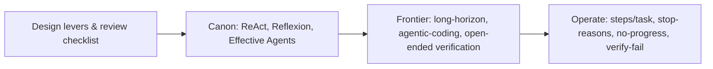

# Loop engineering — design review, frontier and operations roadmap

## Roadmap: design review, frontier and operations

**What this section covers.** The senior view of loop engineering: the levers you pull and the checklist
you walk to review a loop design, the canon you should be able to name, where the research frontier
sits, and the signals you watch once a loop is running in production.

**The ideas you'll meet:**

- **Design review checklist** — shape, progress and verification, bounding, recovery, state: the five checks that place any loop on the toy → production ladder.
- **The canon** — ReAct (reason-then-act), Reflexion (self-reflect and retry), Toolformer (learned tool use), Tree of Thoughts (deliberate search), and Anthropic's "Building Effective Agents".
- **The frontier** — reliable long-horizon autonomy, agentic-coding benchmarks (SWE-bench-style), and verifying open-ended tasks.
- **Production signals** — steps per task, stop-reason distribution, no-progress / stuck rate, and verification-failure rate.
- **Interview signals & red flags** — most-constrained-shape and bound-and-verify read as senior; unbounded loops and trusting unverified progress sink candidates.

**Why it matters.** Being able to review a loop, name the canon, and operate it on real signals — not
just build one that demos — is what reads as senior in a design review or an interview.

**See also.** The production signals overlap [llm-observability] and the bounding in
[agent-guardrails-budgets]; the taxonomy of what goes wrong live is [production-failure-modes].
