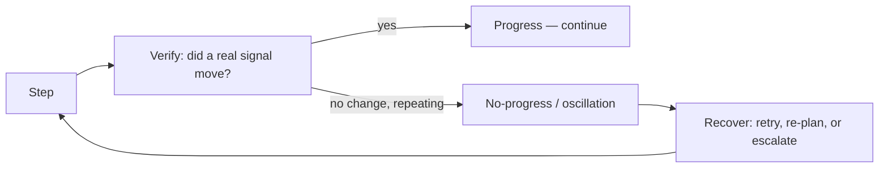

# Loop engineering — progress, convergence and recovery roadmap

## Roadmap: progress, convergence and recovery

**What this section covers.** A loop that runs is not the same as a loop that **gets somewhere**. This
section is about making a loop converge on its goal: defining measurable progress, detecting when the
agent is stuck, recovering from failure by turning it into a next action, and keeping the loop's
growing context from becoming its own failure mode.

**The ideas you'll meet:**

- **Measurable progress** — each iteration moves a concrete, checkable signal toward the goal, not just "the agent did something".
- **No-progress detection** — the same action or state repeating with no change is the trigger to intervene.
- **Oscillation** — flipping between two states (undo/redo) without net progress; a stuck pattern the loop must break.
- **Convergence vs. thrash** — steps that steadily reduce the remaining work, versus staying busy without closing the gap.
- **Recovery** — turning a failure into the next action (retry, re-plan, escalate) instead of crashing or blindly repeating.
- **Compaction** — summarizing or dropping stale observations so a long loop keeps the signal it needs without paying to re-send everything.

**Why it matters.** Length is the enemy of reliability: the longer a loop runs, the more context piles
up and small errors compound. Progress detection, recovery, and compaction are what let a loop run long
and still **finish** instead of drifting, thrashing, or running away the bill.

**See also.** The bounding that stops a stuck loop (budgets, breakers) is [agent-guardrails-budgets];
the taxonomy of what goes wrong in production is [production-failure-modes].
