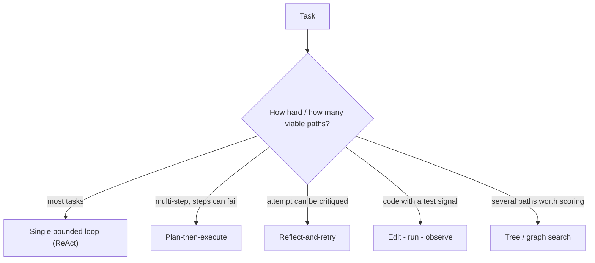

# Loop engineering — loop shapes roadmap

## Roadmap: loop shapes and when to use each

**What this section covers.** The observe → decide → act → verify cycle can be wired into several
**shapes**, and picking the right one is a design decision with real tradeoffs. This section is the
menu of shapes — single bounded loop, plan-then-execute, reflect-and-retry, the edit-run-observe
coding loop, and search loops — and the rule for choosing among them.

**The ideas you'll meet:**

- **Single bounded loop (ReAct)** — think → act → observe with budgets and guards; the sensible default for most tasks.
- **Plan-then-execute** — separate planning from doing so each step is independently checkable and re-plannable.
- **Reflect-and-retry** — critique a failed attempt and revise the approach, instead of repeating it.
- **The coding loop (edit → run → observe)** — the shape behind coding agents; the test/build run is the deterministic gate on the next edit.
- **Search loops (tree / graph)** — explore and score multiple branches; powerful but multiplies cost and coordination.
- **Most-constrained-shape rule** — reach for the simplest shape that does the job; add structure only when a simpler loop demonstrably fails.

**Why it matters.** The shape you pick sets the ceiling on reliability and the floor on cost. Reaching
for a heavy shape by reflex burns money and adds failure surface; refusing to escalate when a simple
loop is clearly stuck ships an agent that never finishes.

**See also.** [agentic-react-loop] develops the ReAct shape in depth; here it is one option among
several. The bounding that every shape depends on lives in [agent-guardrails-budgets].
