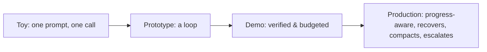

## Reviewing a loop design

**In brief.** Every loop decision trades how much autonomy you grant the model against how much
reliability the surrounding code guarantees. Reviewing one — in a design doc or an interview — means
checking five levers and insisting that reliability is engineered into the loop, not reworded into the
prompt.

**The five levers.**

- **Loop shape** — a single bounded loop, plan-then-execute, reflect-and-retry, edit-run-observe, or search. The **most-constrained-shape rule**: use the simplest shape that works and escalate only on a real signal; reaching for multi-agent or search when one loop would do is over-engineering.
- **Progress and verification** — what counts as measurable progress, and whether each step is gated on a real, checked signal before the next. Acting without verifying lets the loop drift on a **false belief**.
- **Termination and bounding** — step/token/time budgets, no-progress and oscillation detection, and named stop reasons. Without them the only exit is the model saying "done" — an unbounded loop.
- **Recovery policy** — what a failure becomes: a crash, a blind retry, or a classified next action. A blind retry thrashes on a permanent failure; recovery must classify, then retry / re-plan / escalate.
- **State management** — what carries across iterations, kept legible with compaction so a long run doesn't drown in its own history.

**The review checklist.**

- What shape, and is it the most constrained that works?
- What counts as progress, and is each step verified before the next?
- What bounds the loop — budgets, no-progress detection, named stop reasons?
- What is the recovery policy — classify the failure, then retry / re-plan / escalate?
- Does state stay legible over length (compaction)?

**Why it matters.** These five checks place any loop on the toy → prototype → demo → production ladder
in minutes, and they name the red flags that sink a candidate: an unbounded loop, trusting unverified
progress, blind-retrying every failure, and reaching for a heavy shape by reflex.
