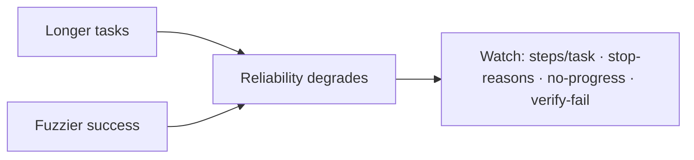

## The frontier & operating a live loop

**In brief.** The research edge and the production dashboard attack the same weakness from two sides: a
loop's reliability degrades as tasks get **longer** and success gets **fuzzier**. Knowing where the
frontier is and which signals to watch is what separates someone who knows loop engineering from
someone who runs it.

**Where the frontier is.**

- **Reliable long-horizon autonomy** — still an open problem. As the loop lengthens, context accumulates and small errors compound, so the agent drifts or gets stuck. Length is the enemy, and reliability at length comes from **harness structure** — plan-then-execute, reflect-and-retry, recovery, and compaction — not a longer prompt.
- **Agentic-coding benchmarks (SWE-bench-style)** — resolve a real issue until the project's own tests go green. These harnesses win or lose on **verification** — running the tests and reading the diff to gate on a real signal — far more than on raw model capability.
- **Verifying open-ended tasks** — the hardest problem: "fix this test" has a deterministic gate, "improve this design doc" does not. The honest move is trustworthy **soft** verification (proxy, rubric, human-in-the-loop) without pretending a soft check is a hard one. The coding gate does not transfer.

**The canon.** ReAct (reason-then-act) is the loop most agents harden; Reflexion adds reflect-retry,
Tree of Thoughts generalizes to search, and Anthropic's "Building Effective Agents" argues the
most-constrained-shape rule.

**Signals to watch in production.**

- **Steps (turns) per task** — cost and latency scale with loop length; a creeping average means tasks are getting harder or the loop is thrashing.
- **Stop-reason distribution** — a healthy fleet is dominated by **done**; a rising **budget-exhaustion** share means budgets are too tight or tasks too hard, while a rising **no-progress** share means loops are getting stuck.
- **No-progress / stuck rate** — the runaway-cost early warning; catch "stuck" before the budget cap fires.
- **Verification-failure rate** — how often the step-check rejects a claimed success; the signal that separates "looks done" from "is done".

**Why it matters.** Alert on budget-exhaustion and no-progress rate (the runaway-cost leading
indicators), read verification-failure rate to know how often the loop was about to drift, and never
reason about a loop fleet in "requests" when the real currency is **steps and tokens per task**.
