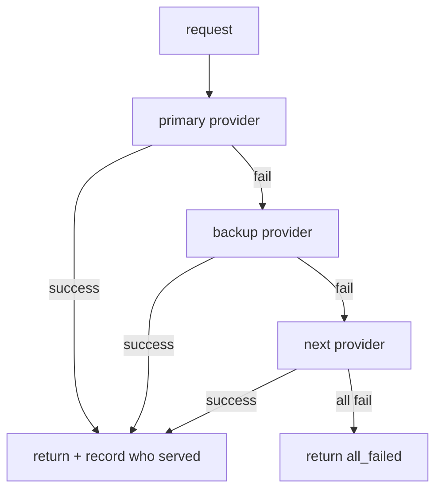

# Build it: a router with fallback and a circuit breaker

## The fallback chain

Give the router an **ordered** list of providers — primary → backup, or cheap → strong. It tries each
in order and returns the result of the **first one that succeeds**. If a provider fails (throws, times
out, rate-limits), the router falls through to the next. If they all fail, it returns a **structured**
`all_failed` rather than crashing — a hard outage should degrade, not throw.

One discipline matters: **record which provider actually served the request**. Silent substitution —
quietly answering from a different model without saying so — is how consistency bugs and surprising
quality changes sneak in.

## Circuit breaker

Repeatedly calling a provider that's down wastes latency and money on every request. A **circuit
breaker** fixes that: it tracks *consecutive failures per provider*, and once that count reaches a
threshold the breaker **opens** — the router **skips** that provider entirely until it recovers. A
success **resets** the count (closes the breaker).

Worked flow with `threshold = 2`: provider `A` throws on two consecutive requests → its failure count
hits 2 → breaker opens. On the next request the router **skips `A`** without even calling it and goes
straight to the next provider. This stops you from hammering a dead dependency and blowing your latency
budget on calls you already know will fail.
