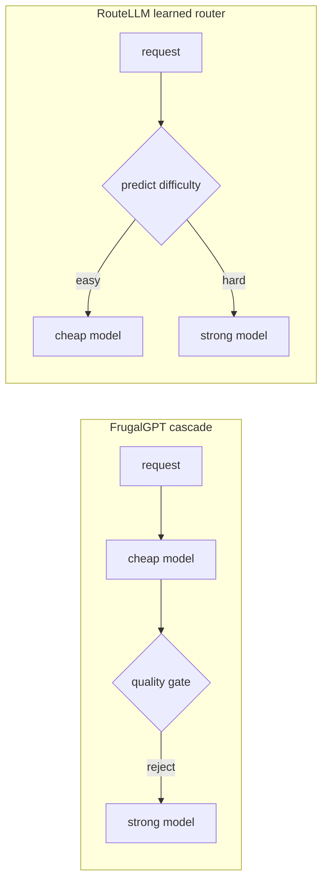

# Model routing & fallback — the frontier and operating it in production

The deep-dive gave you the levers. This lesson drills the two things that separate someone who *knows*
model routing from someone who *runs* it at the frontier: the current research edge, and the operational
signals you watch when the gateway is live.

## The model-routing-fallback frontier

Two research directions define where routing work is actually moving, and both attack the same
tension: **spend as little as possible without silently lowering answer quality.**

- **Cost cascades vs. learned routing.** The two canon results come at the cost problem from opposite
  directions. **FrugalGPT** (Chen et al., Stanford) is a *cascade*: call a cheap model first and
  escalate to a stronger one **only when a quality gate says the cheap answer isn't good enough** — you
  spend compute on hard requests and save on the easy majority. **RouteLLM** (LMSYS) is a *learned
  router*: instead of trying-then-checking, it **predicts up front how hard each request is** and sends
  it straight to the cheapest model likely to clear the quality bar. The mental model to carry: a
  cascade *discovers* difficulty by paying for a first attempt; a learned router *predicts* difficulty to
  skip that attempt. Both live or die on the same signal — whether the difficulty judgment is right often
  enough that the cheap path handles the work without leaking bad answers.

- **Quality-preserving routing and consistency under model swaps.** This is the open frontier, and it's
  where naive routing quietly fails. The hard problem is not "route to something cheaper" — it's routing
  that does **not silently change answer quality**, and keeping outputs **consistent when the underlying
  models are swapped** (a fallback fires, a provider is deprecated, a route is re-tuned). The failure this
  guards against is the classic antipattern: a swap that looks free on a cost dashboard but shifts tone,
  format, or correctness in ways users feel. The load-bearing unknown underneath both directions is
  **accurate difficulty prediction** — misjudge difficulty and you either overpay (easy work sent to the
  strong model) or degrade quality (hard work sent to the weak one).

The reason to track this line specifically: both directions are really bets on the same predictor, and
the honest way to read any new routing claim is to ask what the difficulty signal is and **what eval
gates it** — not to accept "cheaper with no quality loss" on faith. An expert can say which lever a given
workload should reach for (cascade when a first attempt is cheap and a quality gate is reliable; learned
routing when the first attempt is expensive and traffic is predictable enough to train on) and why a
swap needs a consistency check, not just a cost check.

## Operating model routing in production

When the gateway is live, you don't watch "routing" — you watch a handful of signals that tell you
whether the router is earning its keep and whether a provider is dragging the system down.

- **Per-route hit rate.** For each model/route, the share of traffic it actually served. This is how you
  know the router is doing what you designed: if the cheap route's hit rate collapses, either traffic
  drifted harder or the difficulty predictor decalibrated — and your cost savings are quietly evaporating.
- **Fallback / escalation rate.** How often the primary path gives way — either a *fallback* fired
  because a provider failed, or a cascade *escalated* because the quality gate rejected the cheap answer.
  This is the headline health-and-cost gauge: a spiking fallback rate means a provider is struggling;
  a spiking escalation rate means the cheap model is handling less of the load than the economics assumed.
- **Circuit-breaker open rate.** How often (and how long) a breaker is tripped open, fast-failing a
  provider instead of piling retries onto it. A breaker that's open a lot is telling you a dependency is
  chronically unhealthy — it's the leading operational signal of a provider problem, and it shows up
  before users see errors because the breaker is absorbing them into fallback.
- **Cost-per-request by route.** The unit economics, sliced by route rather than by model. This is what
  turns the whole design honest: routing exists to move the *cost-per-request* curve, so you track it
  per route to confirm the easy majority is actually landing on the cheap path — and to catch a drift
  where escalations or hedges are silently inflating spend.

The operational discipline: alert on **circuit-breaker open rate and fallback/escalation rate** (leading
indicators that a provider is failing or the router is mis-routing), capacity- and cost-plan on
**per-route hit rate and cost-per-request by route**, and never call a routing change a win from a single
average — the whole point of routing is what happens *per route*, so that's the currency you watch.
