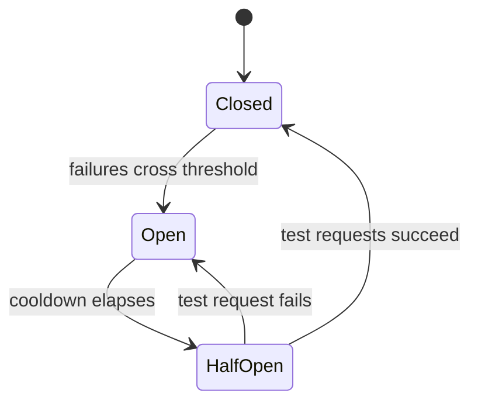

# Resilience: breakers, hedging & backoff

## Circuit breakers and backoff

When a provider gets flaky, the worst thing you can do is retry harder. A pile of clients retrying a
struggling provider in lockstep is a **retry storm** that keeps it down. Two patterns tame this.

A **circuit breaker** sits in front of the provider and counts failures. When failures cross a
threshold, it **trips open**: further calls **fail fast** — immediately erroring or diverting to the
fallback — instead of waiting on a provider that is already drowning. After a cooldown it **half-opens**,
letting a trickle of test requests through; if they succeed it closes again, otherwise it re-opens.
The breaker protects the provider *and* your latency, because failing fast beats waiting for a timeout.

**Retries** are still useful for transient blips, but they need discipline:

- **Exponential backoff** — wait progressively longer between attempts (e.g. 1s, 2s, 4s) so you don't
  hammer a recovering provider.
- **Jitter** — add randomness to each delay so many clients don't retry at the *same* instants. Plain
  backoff still lets synchronized clients form a coordinated spike (a thundering herd); jitter spreads
  them out.

Cap the number of retries, and combine retries with a breaker so a persistent outage flips to fallback
rather than looping forever.

## Hedged requests

Sometimes the provider isn't down — it's just occasionally *slow*, and that long tail (p99) hurts. A
**hedged request** attacks tail latency directly: send the request to the primary, and if it hasn't
responded within a short threshold, fire a **duplicate** to a backup model. Take whichever responds
first and cancel the other.

Hedging is not the same as retrying after a full timeout — it starts the backup *before* giving up on
the first, so the user never waits out the whole timeout. The cost is **extra spend**: you sometimes
pay for two requests to serve one. That's the trade — money for a shorter tail — so hedge selectively,
on latency-sensitive paths and with a threshold tuned so you only duplicate the genuinely slow ones.
