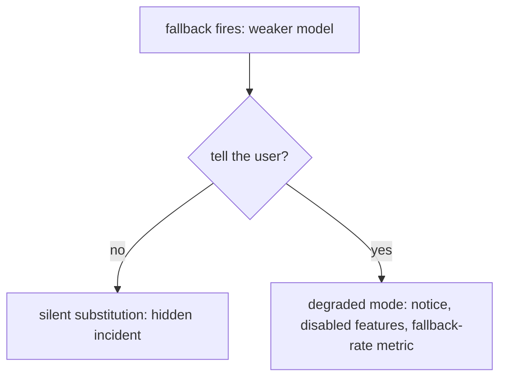

# Model routing & fallback — degraded-mode roadmap

## Roadmap: Degraded-mode UX

**What this section covers.** What the user sees when a fallback path uses a weaker model — the
silent-substitution antipattern versus an honest degraded mode that stays usable while signalling that
capability is reduced — and how this whole topic reads in an interview or design review.

**The ideas you'll meet:**

- **Silent substitution** — quietly serving a weaker model's answer as if nothing changed; the core antipattern.
- **Degraded mode** — keeping the product usable while being transparent that capability is reduced.
- **Honest signals** — a banner or lowered-confidence notice, plus disabling what the fallback can't do.
- **Fallback rate** — the metric that surfaces degradation to operators on a dashboard instead of only to confused users.
- **Interview red flags** — silent substitution, no circuit breaker, and unbounded retry storms are what sink a routing/fallback design.

**Why it matters.** A silent swap trades a visible, understood degradation for an invisible, confusing
one — honesty is what keeps user trust and lets operators see an incident instead of hiding it.
