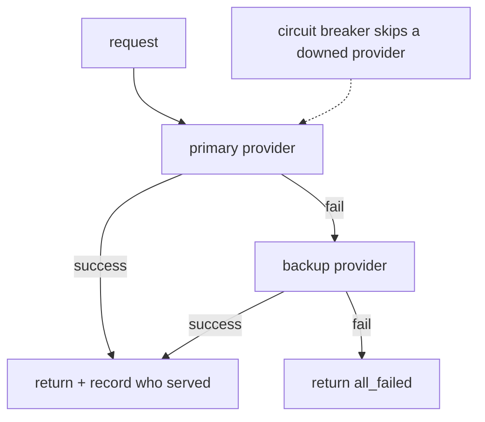

# Model routing & fallback — fallback roadmap

## Roadmap: Fallback chains & the router

**What this section covers.** What a system does when the chosen provider *fails* rather than which
model is best — an ordered fallback chain that returns the first success, a structured `all_failed`
instead of a crash, and a circuit breaker that stops hammering a provider that is already down.

**The ideas you'll meet:**

- **Fallback chain** — an ordered list of providers, tried in turn until one succeeds.
- **First success** — the chain returns the result of the first provider that works, and falls through on any failure.
- **`all_failed`** — a structured result when every provider fails, so a hard outage degrades instead of throwing.
- **Record who served** — logging which provider actually answered, so silent substitution can't hide.
- **Circuit breaker** — tracks consecutive failures per provider and skips one that has crossed the threshold, until a success resets it.

**Why it matters.** Fallback is a different decision from routing: it is what keeps a user getting an
answer instead of a hard error when a provider times out, rate-limits, or goes down.
