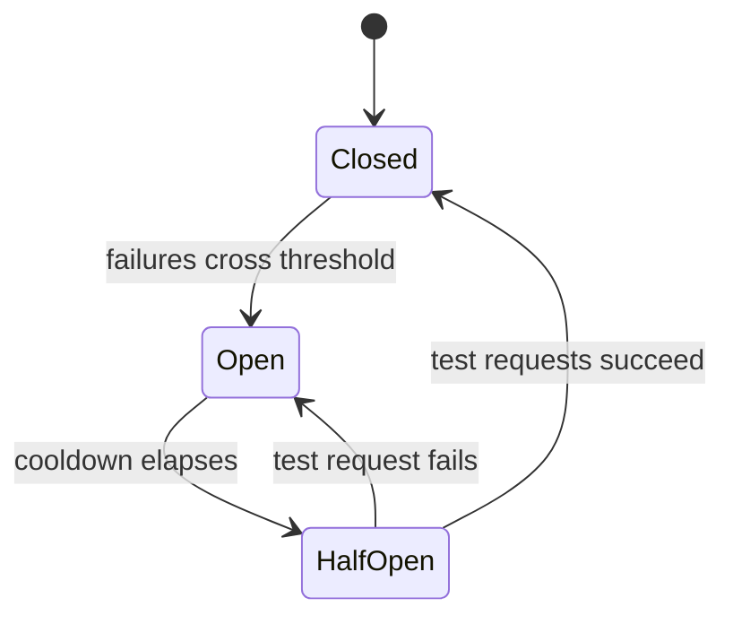

# Model routing & fallback — resilience roadmap

## Roadmap: Resilience — breakers, backoff & hedging

**What this section covers.** How to stay up when a provider is flaky or slow without making it worse:
a circuit breaker that fails fast, retries disciplined by exponential backoff and jitter, and hedged
requests that attack tail latency — plus how to weigh all these levers when reviewing a design.

**The ideas you'll meet:**

- **Circuit breaker (state machine)** — Closed → Open when failures cross a threshold → HalfOpen after a cooldown → Closed again once test requests succeed.
- **Fail fast** — an open breaker errors or diverts to fallback immediately instead of waiting on a drowning provider.
- **Exponential backoff** — wait progressively longer between retry attempts so you don't hammer a recovering provider.
- **Jitter** — randomize each delay so synchronized clients don't form a thundering herd, or retry storm.
- **Hedged request** — after a short delay, fire a duplicate to a backup and take whichever answers first, trading extra spend for a shorter p99 tail.
- **Reviewing a design** — walking the five levers (routing policy, cascade depth, failure handling, latency shaping, degraded UX) and rating it toy → production-ready.

**Why it matters.** When a provider struggles, the naive reflex — retry harder — is exactly what
turns a blip into an outage; these patterns are what let a system survive one instead of amplifying it.
