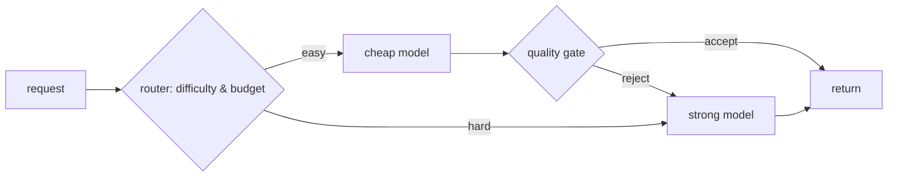

# Model routing & fallback — routing roadmap

## Roadmap: Routing & model cascades

**What this section covers.** How a system matches each request to the cheapest model that can handle
it — the routing signals a router reads, the cheap→strong cascade that a quality gate escalates, and
the frontier debate over discovering difficulty (a cascade) versus predicting it (a learned router).

**The ideas you'll meet:**

- **Routing** — matching each request to the cheapest model that can still handle it.
- **Router** — the component that inspects a request and decides where it goes.
- **Routing signals** — what the router reads: predicted difficulty, prompt/context length, required capabilities, and the cost/latency budget.
- **Model cascade** — the cheap→strong pattern: try a cheap model first, escalate only when a gate rejects it.
- **Quality gate** — the confidence score, verifier, or self-check that decides whether the cheap answer is good enough.
- **FrugalGPT vs. RouteLLM** — a cascade *discovers* difficulty by paying for a first attempt; a learned router *predicts* difficulty up front and skips it.
- **Per-route hit rate** — the share of traffic each route actually serves; the signal that tells you the router is still earning its keep.

**Why it matters.** Routing is the core economic bet of the whole topic — get it right and most traffic
is served cheaply while the strong model is reserved for the requests that genuinely need it.
