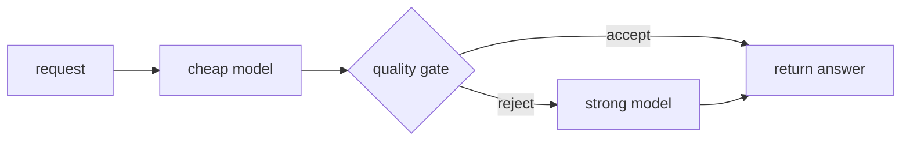

# Model routing & cascades

## Why route and when to fall back

Not every request needs your strongest, most expensive model. Most are easy — a short lookup, a
simple rewrite — and a small, fast, cheap model answers them just as well. **Routing** matches each
request to the cheapest model that can handle it, so you save cost and latency and reserve the
expensive model for the genuinely hard cases.

A **router** is the component that inspects an incoming request and decides where it goes. It decides
using signals *about the request itself*:

- **Predicted difficulty / complexity** — is this a trivial or a hard task?
- **Prompt length and context size** — does it even fit the cheap model?
- **Required capabilities** — does it need tools, vision, or long-context reasoning?
- **Budget** — the per-request cost and latency ceiling.

**Fallback** is a different decision from routing. Routing picks the *best* model for a healthy
system; fallback is what you do when the chosen provider *fails* — it times out, returns 5xx or 429
(rate-limited) errors, or is simply down. Fallback reroutes to an alternate model or provider so the
user still gets an answer instead of a hard error.

## Routing signals and model cascades

The workhorse routing pattern is the **model cascade**: try cheap→strong. Send the request to a
cheap, fast model first, then apply a **quality gate** — a confidence score, a small verifier model,
or a self-check. If the gate accepts the cheap answer, you're done at low cost. Only when the gate
*rejects* it does the request **escalate** to a stronger, costlier model.

Because most requests pass the gate, a well-tuned cascade gets close to strong-model quality at close
to cheap-model cost. The tuning is the whole game, though:

- **Gate too strict** — you escalate almost everything, losing the savings and adding a hop of
  latency to the hard cases.
- **Gate too loose** — bad cheap answers slip through as if they were fine.

This is the FrugalGPT idea: spend more only where it buys quality, and let a gate decide where that
is. Never invert the cascade — starting with the strongest model defeats the purpose.

Routing and the cheap→strong cascade matter because they are the core economic lever of the whole
topic: served well, most traffic runs cheap and fast while the expensive model is held in reserve for
the requests that actually need it.
