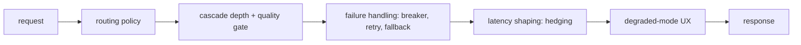

## Reviewing a routing and fallback design

**In brief.** Every routing decision is really one decision: which model handles which request, and
what happens when that model is slow, wrong, or down — under a fixed cost and latency budget.
Reviewing a design means walking five independent levers, naming what each one costs, and rating the
result toy → prototype → demo-ready → production-ready.

**The five levers.**

- **Routing policy** — how the first model is picked: a **static rule** (a model per route or tenant), **difficulty-based routing** (a cheap classifier or heuristic predicts hardness and sends easy requests to a small model), or a **learned router** trained to predict which model clears a quality bar. More signal buys cost savings but adds a predictor you must train, calibrate, and monitor for drift.
- **Cascade depth** — one model, or a cheap→strong cascade where a **quality gate** escalates only the requests the cheap model fails. The gate is the cost/quality knob: you pay `cheap + X·strong` where `X` is the escalation rate it produces. Loosen it and cost drops but bad cheap answers leak; tighten it and savings evaporate. An untuned gate — say a length-only check — drives `X` toward 1, so cost barely beats sending everything to the strong model. There is no free setting; it is a budget line validated on held-out traffic, not vibes.
- **Failure handling** — what happens on a timeout, 429, or 5xx: hard-fail, **retry with backoff+jitter**, **fall back** to an alternate provider, or trip a **circuit breaker** so calls fail fast. Retries multiply load exactly when the provider is weakest: N clients each retrying K times is up to `N·K` requests hitting something already failing. Fixed-delay, unjittered retries let clients retry in lockstep — a self-inflicted retry storm. Backoff+jitter spreads them in time; the breaker caps them entirely by failing fast to the fallback. Raising the retry count or shrinking the delay makes the storm worse.
- **Latency shaping** — **hedged requests**: after a short delay, fire a duplicate to a backup and take whichever answers first. Buys lower p99 at the cost of extra spend and load, so hedge only past a p95 threshold — and note it addresses tail latency, never a cost problem.
- **Degraded-mode UX** — when the fallback path is a weaker model, whether the substitution is **silent** or **honest** (a notice, a lowered-confidence indicator, disabled features, plus a **fallback-rate** metric). This is a product lever, not just an infra one, and it is where trust is won or lost.

**The review checklist.**

- What decides the route, and is it calibrated? An uncalibrated router with no drift monitoring silently mis-routes as traffic shifts.
- Where is the quality gate, and how is it tuned? No explicit, validated gate means the cascade either leaks bad cheap answers or escalates everything and loses the savings.
- What happens on failure? No circuit breaker, or uncapped/unjittered retries, is an immediate flag.
- Is the fallback honest? A weaker fallback swapped in silently is the classic antipattern — a real design has a degraded-mode UX and emits a fallback-rate metric. The fix is honesty, not hard-failing the user back to a manual retry.
- What does the user experience under pressure? A real design names what happens when everything is slow or down — queue, degrade with a notice, or reject — never "it just works."

**Why it matters.** The ladder falls out of the checklist: a toy sends everything to one model, a
prototype adds a fallback, a demo adds breakers and backoff, and a production-ready design also routes
by difficulty with a tuned gate, bounds retries, degrades honestly, and watches its fallback rate. Name
the lever, name what it costs, name the regime where it wins — "just add retries and a fallback model"
without the retry-storm risk, the breaker, or the silent-degradation problem signals shallow depth.
