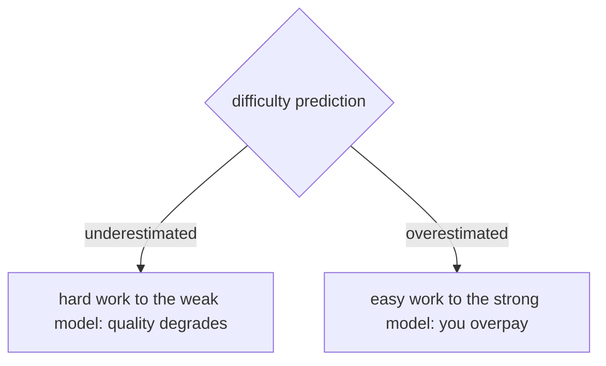

## The frontier & operating a live gateway

**In brief.** The research edge and the production dashboard attack the same tension: spend as little
as possible without silently lowering answer quality. Knowing what the frontier is still arguing about,
and which signals to watch once the gateway is live, is what separates someone who **knows** model
routing from someone who **runs** it.

**Where the frontier is.**

- **Accurate difficulty prediction** — the load-bearing open problem. Cascades and learned routers are really bets on the same predictor, and getting it wrong hurts in both directions: underestimate difficulty and hard work goes to the weak model, so quality silently drops; overestimate it and easy work goes to the strong model, so you pay for capability you didn't need. A circuit breaker cannot rescue a bad prediction — it handles provider **failure**, not misjudged difficulty. The whole economic case (route the easy majority to a model that is much cheaper per token and spend falls sharply) rests on the predictor being right often enough.
- **Quality-preserving routing and consistency under model swaps** — the open frontier, and where naive routing quietly fails. The hard problem is not routing to something cheaper; it is routing that does **not** silently change answer quality, and keeping outputs consistent when the underlying models are swapped — a fallback fires, a provider is deprecated, a route is re-tuned. The failure it guards against is a swap that looks free on a cost dashboard but shifts tone, format, or correctness in ways users feel.
- **How to read a routing claim** — a cost dashboard cannot see a tone or correctness shift, so never accept "cheaper with no quality loss" on faith. Ask what the difficulty signal is and **what eval gates it**; a swap needs a consistency check, not just a cost check.

**Signals to watch in production.**

- **Circuit-breaker open rate** — how often, and how long, a breaker is tripped open. This is the leading operational signal of a provider problem: a breaker that is open a lot means a dependency is chronically unhealthy, and it spikes **before** users see errors precisely because the breaker is fast-failing those calls into the fallback path and absorbing them.
- **Fallback and escalation rate** — how often the primary path gives way, either because a provider failed (fallback) or because the quality gate rejected the cheap answer (escalation). The headline health-and-cost gauge: a spiking fallback rate means a provider is struggling; a spiking escalation rate means the cheap model is handling less of the load than the economics assumed.
- **Per-route hit rate** — the share of traffic each model or route actually served, and the check that the router is doing what you designed. If the cheap route's hit rate falls while escalation climbs at a constant request rate, either traffic drifted harder or the difficulty predictor decalibrated — and the cost savings are quietly evaporating.
- **Cost-per-request by route** — the unit economics sliced by route rather than by model. Routing exists to move the cost-per-request curve, so this is what confirms the easy majority is actually landing on the cheap path, and what catches escalations or hedges silently inflating spend.

**Why it matters.** Alert on **circuit-breaker open rate** and **fallback/escalation rate** — the
leading indicators that a provider is failing or the router is mis-routing — and capacity- and
cost-plan on **per-route hit rate** and **cost-per-request by route**. Never call a routing change a
win from a single blended average: the whole point of routing is what happens per route, so that is the
currency you watch.
