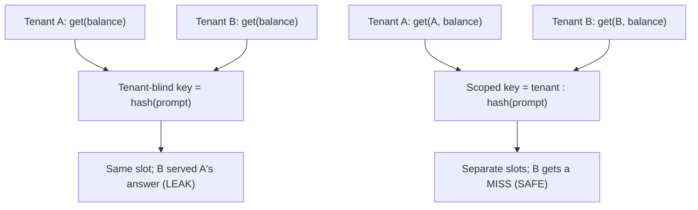

# Multi-tenant isolation — cache-key safety roadmap

## Roadmap: cache-key safety

**What this section covers.** The cheapest isolation lever and the one most often botched — the cache
key. A key that carries only the prompt serves one tenant's answer to another; folding tenant scope
into the key turns that silent leak into a safe miss.

**The ideas you'll meet:**

- **Response cache** — returns a stored answer when a request repeats; the danger is entirely in the key.
- **Tenant-blind key** — a prompt-only key that makes two tenants' identical requests collide on one slot.
- **Tenant-scoped key** — a key namespaced by tenant (plus normalized request and model/version) so collisions can't cross tenants.
- **Cross-tenant miss** — the correct, load-bearing behavior: `get(B, key)` returns null, never A's data.
- **Semantic cache** — returns an answer on embedding *similarity*, widening the leak surface to paraphrased queries.
- **Cache poisoning** — a collidable key namespace lets an attacker write an entry a victim tenant will later read.

**Why it matters.** A tenant-blind key passes every single-tenant demo and leaks the instant a second
tenant shares the cache, so scoping the key is the highest-leverage fix on this whole topic.
