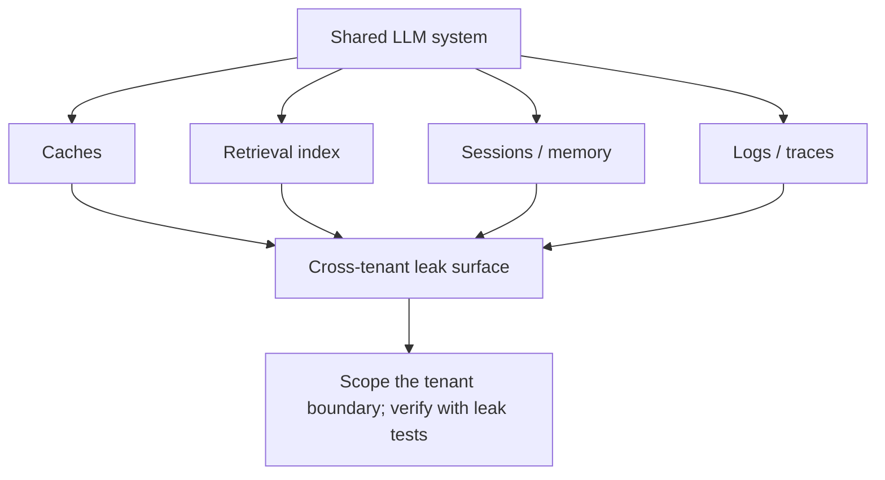

# Multi-tenant isolation — foundations roadmap

## Roadmap: isolation dimensions and the threat model

**What this section covers.** Where cross-tenant leaks actually live in a shared LLM system — not in
the model weights but in the shared state around it — and the design levers you pull to keep one
tenant's data from surfacing in another's session or answer.

**The ideas you'll meet:**

- **Isolation** — the invariant that one tenant's data must never surface in another tenant's session or answer.
- **Shared state** — the caches, index, sessions, and logs around the model where leaks live, not the weights.
- **Isolation dimensions** — the four surfaces you must separate: caches, the retrieval index, conversation memory/sessions, and logs/traces.
- **Efficiency vs. safety tradeoff** — sharing resources is cheap but is exactly what creates the leak surface; the choice it forces is pooled vs. siloed.
- **Noisy neighbor** — one tenant's load degrading another's latency: an availability problem, distinct from a confidentiality leak.
- **Tenant boundary** — how far down the stack "this data belongs to tenant A" is pushed so a query, cache hit, or log write cannot cross it.
- **Isolation / leak tests** — adversarial probes that assert a zero cross-tenant leak rate.

**Why it matters.** Every later section — cache keys, retrieval scoping, the production frontier —
is one shared surface where this same boundary can be forgotten, so the threat model here is the
lens you carry through the whole topic.
