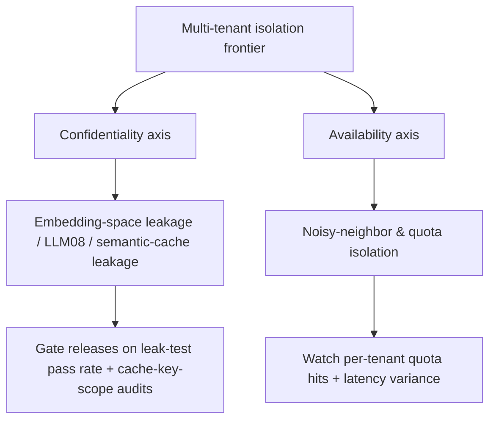

# Multi-tenant isolation — frontier & operations roadmap

## Roadmap: frontier and operations

**What this section covers.** Where the research edge sits on shared embedding/retrieval/cache
surfaces, the availability axis (noisy neighbors) an expert names unprompted, and the handful of
production signals that tell you whether the tenant boundary is still holding once a second tenant is
live — plus how to talk about all of it in an interview.

**The ideas you'll meet:**

- **Embedding-space leakage** — the open problem: similarity geometry can carry data across tenants even with scoped keys and pre-filtered retrieval.
- **Semantic-cache cross-tenant leakage** — a similarity-keyed cache serving A's answer to B's near-duplicate query; the live questions are safe threshold and invalidation.
- **OWASP LLM08** — Vector and Embedding Weaknesses, the field's acknowledgement that cross-tenant retrieval leakage is a recognized class.
- **Noisy-neighbor / quota isolation** — the availability face: per-tenant quotas and partitions bound one tenant's load so it degrades only itself.
- **Cross-tenant leak-test pass rate** — the release gate asserting a zero cross-tenant leak rate.
- **Cache-key-scope audits & latency variance** — the confidentiality and availability signals you watch in production.
- **Security tradition, not a paper** — the canon is SaaS/security practice (RLS, per-tenant partitions), and inventing a seminal paper is an interview red flag.

**Why it matters.** Knowing where the leaks actually live, pointing to LLM08, and naming the leak-test
gate is what separates someone who *knows* isolation from someone who *runs* it — and it is exactly
what a senior interview probes.
