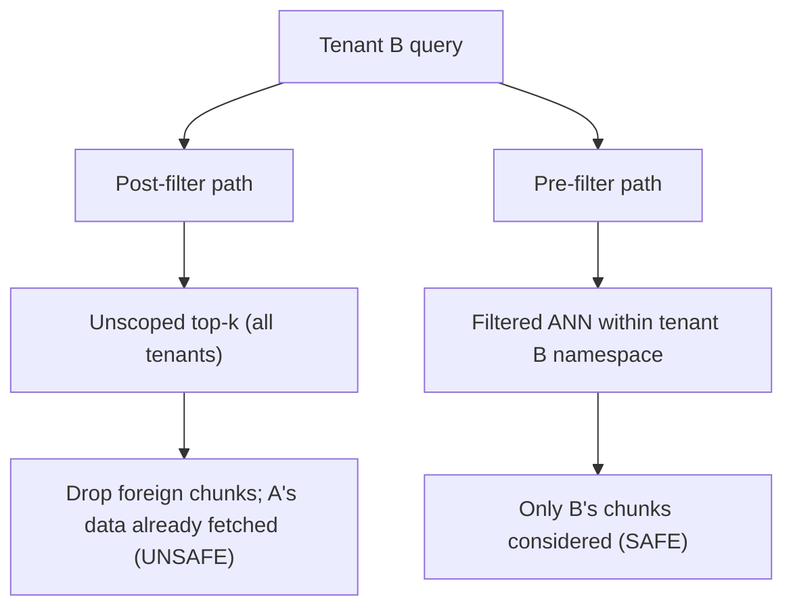

# Multi-tenant isolation — retrieval scoping roadmap

## Roadmap: retrieval scoping and contamination

**What this section covers.** How to keep a shared vector index from returning one tenant's chunks to
another's query, why the scope must live *inside* the search rather than after it, and the other
stateful surfaces — sessions and logs — through which context still bleeds across users.

**The ideas you'll meet:**

- **Authorization filter** — a `tenant_id` on every chunk's metadata that every search must apply so it only sees the caller's documents.
- **Per-tenant namespace / partition** — a physical slice of the store a query cannot reach past.
- **Row-level security (RLS)** — the same tenant predicate enforced in the backing datastore, not in app code.
- **Pre-filter vs. post-filter** — scoping the search itself vs. running an unscoped top-k and stripping foreign chunks afterward (unsafe).
- **Context contamination vectors** — reused sessions, shared caches, unscoped retrieval, and pooled logs.
- **State reset** — scoping session and memory per user and clearing state between users.

**Why it matters.** Retrieval and reused sessions feed straight into the token budget, so an unscoped
search or a reused conversation object leaks another tenant's data into the prompt itself, where no
storage-level guard can catch it.
