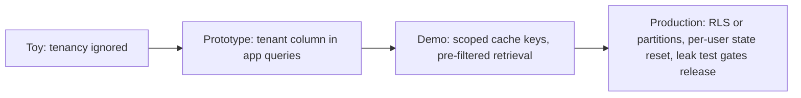

## Reviewing a multi-tenant isolation design

**In brief.** Every isolation decision is really a decision about **where the tenant boundary lives** —
how far down the stack you push "this data belongs to tenant A" so a query, a cache hit, or a log write
**cannot** cross it, even when app code forgets. Reviewing a design means walking five levers and
insisting the boundary is enforced by the engine and the test suite, never by a convention app code is
trusted to follow.

**The five levers.**

- **Data partitioning** — a shared table or index with a tenant column, versus per-tenant partitions and namespaces, versus a database or index per tenant. Sharing is cheapest and scales to many small tenants; hard partitioning is the strongest boundary but multiplies operational cost. Choosing a per-tenant index over a filtered shared index trades **higher resource and operational cost for stronger, simpler isolation** — so match the grain to the tenant-size distribution rather than reaching for the most-isolated option by reflex. A database per tenant is uneconomic against a long tail of tiny tenants; few large tenants with contractual isolation is where it wins.
- **Boundary enforcement** — the tenant predicate in application `WHERE` clauses versus in the **engine** via **row-level security (RLS)**. App-layer predicates are one missed clause from leaking every tenant's rows, and code review is not a guarantee. RLS puts the check where a developer cannot forget it; per-tenant partitions are a similar backstop. Renaming the column or indexing it addresses neither.
- **Retrieval scoping** — **pre-filter** the ANN search to the tenant's namespace or authorized set, or **post-filter** after an unscoped top-k. Post-filtering runs the search over everyone's chunks: another tenant's more-similar rows crowd out the caller's (leaving too few, possibly zero, valid results) and their data has **already been fetched into the process**. Raising top-k does not fix the boundary, and no embedding model separates tenants in vector space — similarity encodes meaning, not ownership.
- **Cache keying** — fold **tenant (and user) identity into the key**, or key on prompt content alone. A tenant-blind key serves one tenant's answer to another **and** lets an attacker seed an entry a victim will later read; on a **semantic** cache the same collision happens on a merely similar query. The fix is scope, not a different hash function and not dropping the cache.
- **Session and state scope** — scope conversation memory, sessions, and logs per tenant and per user, or pool them. Reused session objects and pooled logs are quiet contamination channels that never show up in a functional demo.

**What each lever costs.**

- **Tenant-scoped cache keys** buy safe reuse of exact-prompt hits and cost you a **lower hit rate** — two tenants asking the identical question no longer share an entry. That is the expected, acceptable price of confidentiality; it does not touch key determinism or answer correctness.
- **RLS** buys an engine-enforced predicate app code cannot forget, and costs policy authoring, testing, and some query-planning overhead.
- **Per-tenant namespaces** buy strong retrieval isolation and a simple mental model, and cost partitions to manage plus cold-start and cost per tenant.
- **Pre-filtered retrieval** protects both safety **and** recall, and costs filtered-ANN complexity plus tenant metadata on the index.

**The review checklist.**

- Where does the tenant boundary actually live — engine or app code? App-only predicates with no RLS or partition backstop is where the review stops.
- Are cache keys tenant-scoped, or is a prompt-only (or shared semantic) key inviting cross-tenant hits and poisoning?
- Is retrieval pre-filtered, or is an unscoped search being cleaned up afterward?
- Is per-user and per-tenant state reset — sessions, conversation memory, logs?
- How is isolation verified — a leak test asserting a **zero cross-tenant leak rate**, or "it works in the demo"?
- Does anything contaminated reach the **token budget**? Retrieved chunks, cached completions, and reused memory must already be tenant-scoped before they hit the prompt; guarding storage while letting foreign content into the context window has moved the leak, not closed it.

**Why it matters.** These five checks place any isolation design on the toy to prototype to demo to
production ladder in minutes, and they name what sinks a design review: a tenant-blind key defended as
"identical prompts are rare", post-filtering sold as a guarantee, and a boundary that exists only in
`WHERE` clauses a developer is trusted to remember.
