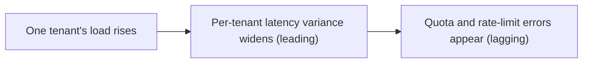

## The frontier & operating multi-tenant isolation

**In brief.** Multi-tenant isolation is a **SaaS and security tradition**, not a topic with one seminal
LLM paper — but the LLM stack reopened old problems on new shared surfaces, and that is where the
frontier lives. It has two axes: **confidentiality** (data crossing the boundary) and **availability**
(one tenant starving the rest). An expert names both without being prompted, and watches a different
set of signals for each.

**Where the frontier is.**

- **Embedding-space leakage as a similarity side channel** — the genuinely open problem. Even with tenant-scoped cache keys and pre-filtered retrieval, the **geometry** of a shared embedding space can carry information across tenants: similarity scores, nearest-neighbor structure, and reconstructed content expose data through the space itself, not through a forgotten `WHERE` clause. Scoped keys plus pre-filtering are **not** a proof of isolation — nobody ships a proof of embedding-space non-leakage, so **provable isolation** and **safe cross-user reuse** (when, if ever, sharing a cached result is acceptable) stay open.
- **OWASP LLM08, Vector and Embedding Weaknesses** — the field's own checklist caught up. OWASP's LLM Top 10 added **Vector and Embedding Weaknesses (LLM08)**, alongside **Sensitive Information Disclosure (LLM02)**, naming embedding-store and cross-tenant retrieval leakage as an acknowledged production surface rather than a footnote. It names a weakness class; it does not ban caching, mandate a shared namespace, or promise that vector databases are isolated by default. Pointing to it is how you signal this is a recognized class, not a hunch.
- **Semantic-cache cross-tenant leakage** — the modern twist on the oldest cache bug. A similarity-keyed cache can serve tenant A's answer to tenant B's **near-duplicate** query because **embedding similarity, not tenant identity, decided the hit**. The live questions are the safe similarity threshold and invalidation; cross-tenant reuse is off by default for anything non-public, because a similarity hit across tenants is a leak **and** a poisoning vector at once.
- **Noisy-neighbor and quota isolation** — the **availability** face, and the reframe that catches people out. One tenant's burst of expensive long-context requests or a hot retrieval loop can starve everyone else of shared capacity, yet **no data crosses the boundary** — a confidentiality lens misses it entirely. You reason about it as capacity and fairness, bounding the blast radius with **per-tenant quotas, rate limits, and partitions** so a noisy neighbor degrades only its own service. Cache-key scoping and swapping embedding models are irrelevant here.

Three of these — embedding leakage, LLM08, semantic-cache leakage — attack the same
embedding, retrieval, and cache path from different angles; noisy-neighbor isolation is the reminder
that availability is a second, separate axis.

**Signals to watch in production.**

- **Cross-tenant leak-test pass rate** — the headline gauge and the **release gate**. A CI or canary suite seeds tenant A, queries as tenant B across **every** shared surface (cache, index, sessions, logs), and asserts a **zero cross-tenant leak rate**. Any leak, ever, fails the build. This is what separates a production-grade design from one that only works in the demo — and nothing about GPU power draw, tenant count, or model size says anything about the boundary.
- **Cache-key-scope audits** — a periodic assertion that every cache entry's key actually carries tenant and user scope. This is the cheapest lever and the one most often botched: a key that regressed to tenant-blind **will not fail a functional test**, and only surfaces as a leak once two tenants collide, so you audit the key shape directly instead of waiting for the collision.
- **Per-tenant quota and rate-limit hits** — the noisy-neighbor signal. A single tenant pinning its own limit is the system **working**; its blast radius is contained. Shared-pool saturation with no per-tenant attribution means you have no isolation on the availability axis at all.
- **Noisy-neighbor latency variance** — per-tenant tail-latency spread under shared load. Rising variance (some tenants fast, some starved) is the **leading indicator** that quota or partition isolation is too coarse and one tenant's load is bleeding into another's latency **before** it shows up as quota errors. Near-zero quota errors therefore do not clear it — and it is an availability signal, not a confidentiality leak and not a cache-key regression.

**Why it matters.** Gate every release on the **leak-test pass rate** and **cache-key-scope audits**
(the confidentiality boundary), watch **per-tenant quota hits** and **latency variance** (the
availability boundary), and be honest that this is a security tradition rather than a single cited
paper — inventing a seminal paper is an interview red flag. Isolation that guards storage but never
tests whether a second tenant can read across a shared surface, or whether one tenant can starve
another, has documented the boundary rather than verified it.
