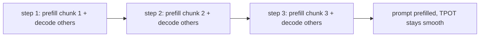

# Why batching helps decode but not prefill

## Batching amortizes a bandwidth cost

Batching runs several requests through the model together. Its payoff depends entirely on which phase
you are in.

In **decode**, each step reads the **full model weights** from memory to produce a single token, then
does very little arithmetic — the phase is **memory-bandwidth-bound** and the compute units are mostly
idle. If you batch many concurrent requests, they all **share that one weight read**: the expensive
trip to memory is paid once and reused across the whole batch. Throughput (tokens/sec across all users)
climbs sharply, and because the arithmetic units had spare capacity, per-user TPOT barely suffers. This
is the core idea behind **continuous batching** in engines like vLLM.

In **prefill**, the story is opposite. A single request already does a **large parallel matmul** over
its prompt, so the GPU's compute is **already saturated** — the phase is **compute-bound**. Adding more
requests just queues up more compute that must still be done; there is no idle capacity to reclaim. So
batching gives decode a big lift and prefill almost none.

The lesson generalizes: **batching amortizes bandwidth-bound work, not compute-bound work.**

## Keeping decode smooth under load: chunked prefill

There is a nasty interaction when the two phases share a GPU. A big **prefill** (a long new prompt) is
a heavy compute burst that can **stall the in-flight decode** of everyone else — their TPOT spikes for
a moment.

**Chunked prefill** (introduced by Sarathi) fixes this by splitting a long prompt into smaller chunks
so that prefill work can be **interleaved** with ongoing decode steps rather than monopolizing the GPU.
Each scheduling step mixes a slice of prefill with the decode of active requests, keeping inter-token
latency smooth for everyone.

A more aggressive option is **prefill/decode (P/D) disaggregation** (DistServe, Splitwise): run prefill
and decode on **separate pools of hardware** so a compute-bound prefill can never interfere with a
bandwidth-bound decode. Each pool is tuned for its own bottleneck, and TTFT and TPOT SLOs are managed
independently.
