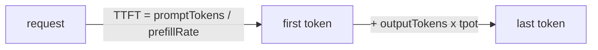

# Build it: a phase-aware latency model

## The two phases in one formula

Inference has two phases with different cost drivers, and a good latency model keeps them separate:

- **Prefill** processes the whole prompt in parallel and produces the first token. Its time is roughly
  `promptTokens / prefillRate` (prefill throughput in tokens/sec) — this is your **time-to-first-token
  (TTFT)**.
- **Decode** generates output tokens one at a time. Each costs `tpot` seconds (**time-per-output-token
  / TPOT**), so decode time is `outputTokens × tpot`.

Putting them together: `total = TTFT + outputTokens × tpot`.

## Why the phases move independently

The whole point of separating them is that they respond to **different** inputs:

- A longer **prompt** raises **TTFT** (more prefill work) but leaves TPOT untouched.
- A longer **output** raises **decode time** (more decode steps) but leaves TTFT untouched.

That's why you optimize each phase differently: **chunked prefill** and **prefill/decode
disaggregation** target TTFT, while **batching** targets decode throughput.

Worked example: `promptTokens = 100`, `outputTokens = 10`, `prefillRate = 1000` tok/s, `tpot = 0.05`
s → TTFT `= 0.1 s`, decode `= 0.5 s`, total `= 0.6 s`. Double the prompt to 200 and TTFT becomes
`0.2 s` (total `0.7 s`) while decode stays `0.5 s`. Mixing the two — e.g. dividing everything by one
"rate" — hides exactly the signal you need to tune the right phase.
