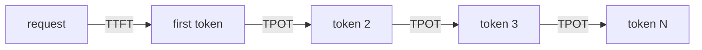

# TTFT vs. TPOT — mapping metrics to phases

## Two metrics, one per phase

A single "latency" number hides what users actually feel. Serving systems track two:

- **TTFT — time to first token.** How long from request until the first output token appears. The
  first token cannot arrive until the prompt has been prefilled, so **TTFT is a prefill metric** and
  scales with **prompt length**.
- **TPOT — time per output token** (also called **inter-token latency**, ITL). The steady-state gap
  between successive output tokens. This is exactly the per-step cost of the sequential decode phase,
  so **TPOT is a decode metric**.

Together they describe the experience: TTFT is the wait before text starts streaming; TPOT is how fast
it then flows. A chat product usually wants low TTFT (responsiveness) *and* low TPOT (smooth
streaming), and they are governed by different phases, so they deserve **separate SLOs**.

## How prompt and output length move the metrics

Because each metric maps to a phase, you can predict how workload shape moves them:

- **Longer prompt → higher TTFT.** More prompt tokens means more to prefill. TPOT is largely
  unchanged, because the per-output-token decode cost does not depend on how long the prompt was.
- **Longer output → higher total latency via TPOT.** Every extra output token is another sequential
  decode step. TTFT is unchanged, because the prompt was the same size.

So a request with a huge prompt and a one-line answer is **prefill-heavy** (TTFT dominates), while a
request with a short prompt and a long answer is **decode-heavy** (TPOT dominates). Diagnosing a slow
request starts with asking which of these it is — the fix lives in a different phase for each.
