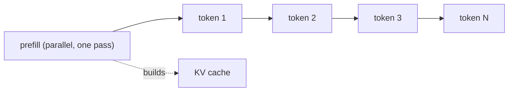

# Prefill vs. decode — two phases, two bottlenecks

## The two phases of inference

Every LLM request runs through two distinct phases, and they behave nothing alike.

**Prefill** processes the entire prompt in a single forward pass. Because all prompt tokens are known
up front, the model can push them through in parallel, building the **KV cache** (the stored keys and
values every later step will attend to). Prefill is where **time to first token** is spent.

**Decode** then generates the output **one token at a time**. Each new token is fed back in to produce
the next, so decode is inherently **sequential** — token N+1 cannot begin until token N exists. This is
the phase that runs for the length of the answer.

The prompt is fully available, so prefill is *parallel*; each output token depends on the previous one,
so decode is *sequential*. That single difference drives everything else.

## Two opposite bottlenecks

The phases stress different parts of the GPU:

- **Prefill is compute-bound.** Processing many prompt tokens at once is a large matrix multiply — lots
  of arithmetic (FLOPs) for each byte of weights moved. The GPU's compute units are the limit, so
  prefill saturates **compute**.
- **Decode is memory-bandwidth-bound.** To emit a *single* token, decode must read the **entire** set
  of model weights (and the growing KV cache) from memory, then do very little arithmetic with them.
  The compute units sit mostly idle waiting on memory, so decode is limited by **memory bandwidth**.

This is why a mental model of "one latency number" is wrong. A change that helps a compute-bound
prefill (say, faster matmul kernels) may do nothing for a bandwidth-bound decode, and vice versa. The
first question to ask about any inference optimization is: **which phase does it touch?**
