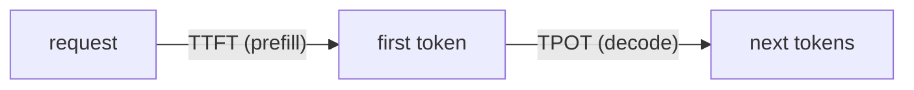

# Prefill vs. decode latency — metrics roadmap

## Roadmap: TTFT and TPOT metrics

**What this section covers.** A single "latency" number hides what users feel, so serving systems track
two metrics — one per phase — and each moves with a different part of the workload.

**The ideas you'll meet:**

- **TTFT** — time to first token; a prefill metric that scales with prompt length.
- **TPOT** — time per output token (a.k.a. inter-token latency / ITL); a decode metric felt as streaming smoothness.
- **Separate SLOs** — because the two metrics are governed by different phases, each deserves its own target.
- **Prefill-heavy vs. decode-heavy** — long prompt + short answer stresses TTFT; short prompt + long answer stresses TPOT.

**Why it matters.** Diagnosing a slow request starts by asking which metric it blew — the fix lives in a
different phase for each, so mapping symptom to metric to phase is the whole game.
