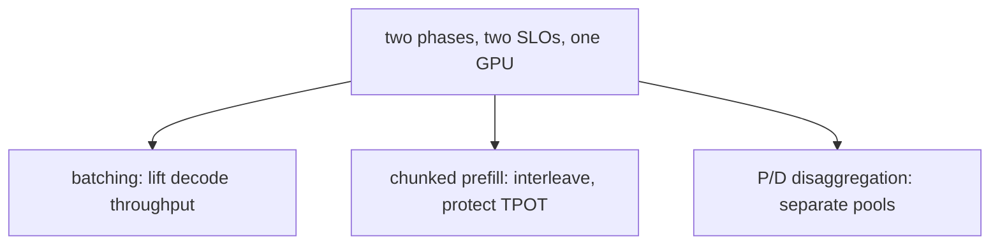

# Prefill vs. decode latency — optimization roadmap

## Roadmap: optimizing prefill and decode

**What this section covers.** Once you know the two phases and their metrics, the serving problem is
hitting two latency targets at once on GPUs the phases must share. This section is the levers you pull —
batching, chunked prefill, disaggregation — plus a phase-aware latency model, how to review a design,
and the frontier and production signals that go with it.

**The ideas you'll meet:**

- **Batching** — running many requests together to amortize decode's bandwidth-bound weight read (continuous batching).
- **Chunked prefill (Sarathi)** — splitting a long prompt so its prefill interleaves with decode instead of stalling it.
- **P/D disaggregation (DistServe, Splitwise)** — running prefill and decode on separate hardware pools, each scaled to its own SLO.
- **Latency model** — the phase-separated formula `total = TTFT + outputTokens × tpot` that keeps the two costs distinct.
- **Per-phase ops** — watching TTFT/TPOT tails, per-phase queue depth, and SLO-attainment rather than one latency number.

**Why it matters.** Every lever here helps one phase and can tax the other, so the payoff comes from
naming the phase a change touches before reaching for it — that discipline is what reads as senior in a
review or interview.
