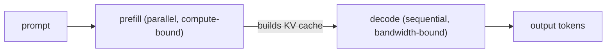

# Prefill vs. decode latency — phases roadmap

## Roadmap: prefill and decode phases

**What this section covers.** Every LLM request runs through two phases with opposite profiles —
*prefill* processes the whole prompt in one parallel pass, then *decode* generates the answer one token
at a time — and each is limited by a different part of the GPU.

**The ideas you'll meet:**

- **Prefill** — the single parallel forward pass over the whole prompt that produces the first token.
- **Decode** — the sequential, one-token-at-a-time generation of the answer; each token depends on the last.
- **KV cache** — the stored keys and values built during prefill that every later decode step attends to.
- **Compute-bound** — prefill's limit: a big matmul that saturates the GPU's arithmetic units.
- **Memory-bandwidth-bound** — decode's limit: each token re-reads all weights from memory, leaving compute idle.

**Why it matters.** The first question to ask about any inference change is *which phase does it touch* —
a fix for a compute-bound prefill often does nothing for a bandwidth-bound decode, and vice versa.
