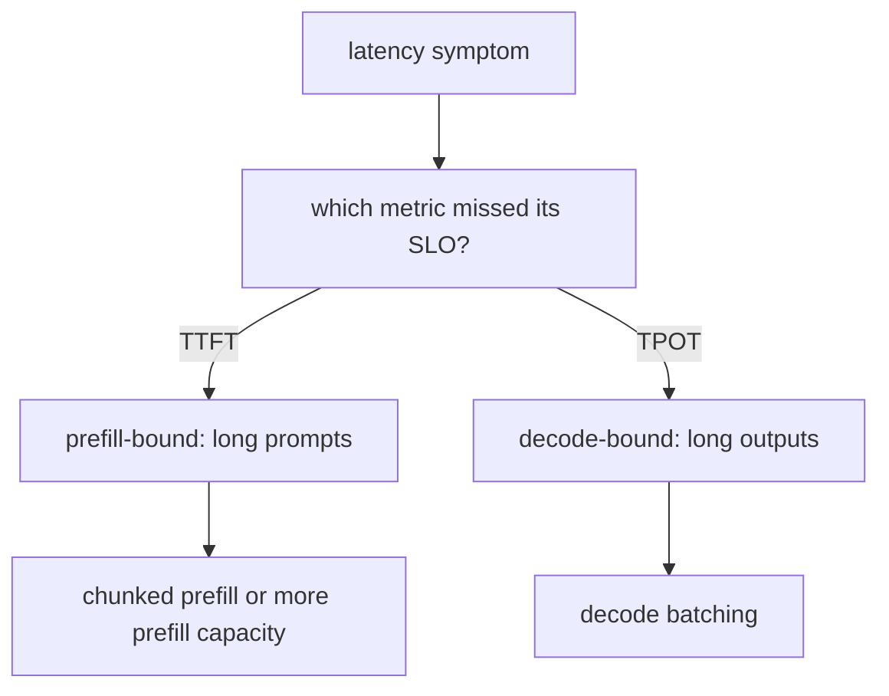

## Choosing the lever and reviewing a design

**In brief.** Every prefill/decode decision is really about hitting two latency targets at once — a TTFT
budget set by prefill and a TPOT budget set by decode — on a workload where both phases fight for the
same GPU. Reviewing one means attributing the symptom to a phase **before** reaching for a fix.

**What each lever actually buys.**

- **Decode batching** — decode reads the **entire** model weights from memory to emit a single token and does very little arithmetic with them, so the phase is memory-bandwidth-bound and the compute units sit mostly idle. Batching many concurrent requests makes them all **share that one weight read**: the expensive trip to memory is paid once and reused across the whole batch. Throughput climbs sharply, and because the arithmetic units had spare capacity, per-user TPOT barely suffers. This is the core idea behind **continuous batching** in engines like vLLM.
- **Why batching does almost nothing for prefill** — a single request's prefill is already a **large parallel matmul** over its prompt, so the GPU's compute is **already saturated**. Adding more requests just queues up more compute that must still be done; there is no idle capacity to reclaim. The rule generalizes: **batching amortizes bandwidth-bound work, not compute-bound work**.
- **What batching costs** — it buys throughput, not a free latency win for everyone. Sharing GPU steps can raise **individual** per-request latency, and a big prefill in the batch can **delay other requests' first tokens**, raising TTFT. Reach for it in a decode-bound, throughput-limited steady state, and balance throughput against latency rather than assuming a bigger batch is strictly better.
- **Chunked prefill (Sarathi)** — splits a long prompt so its prefill interleaves with ongoing decode instead of monopolizing a step, keeping TPOT low under load. Costs chunk-scheduling complexity and slightly higher TTFT per request.
- **Separate TTFT and TPOT SLOs** — each phase measured and budgeted on its own terms. Costs two targets to track and schedule against; worth it for any product with both prompt-heavy and generation-heavy traffic.

**The two antipatterns.**

- **One latency number.** A single end-to-end SLO averages the two phases together, so you cannot tell whether a regression came from prefill or decode — the phases optimize differently and are stressed by different traffic (prompt length vs. output length). The fix is **separate TTFT and TPOT SLOs**, not a tighter threshold or a different percentile. You cannot optimize what you have averaged away.
- **Optimizing the wrong phase.** Longer prompts load prefill and set TTFT; longer outputs load decode and set TPOT. Throwing decode batching at a prefill-bound, long-prompt TTFT miss does nothing, because batching only amortizes the bandwidth-bound weight read and lifts **decode** throughput — chunked prefill or added prefill capacity targets the phase that is actually bound. Shrinking prompts to "fix" a decode-bound, long-output workload is the same error mirrored. Both pass a single-user demo and degrade the moment mixed, concurrent traffic arrives.

**The ladder.**

- **Toy** — reports one latency number and ignores the phase split.
- **Prototype** — measures TTFT and TPOT separately.
- **Demo-ready** — adds chunked prefill so a long prompt never stalls in-flight decode.
- **Production-ready** — also decides, with data, whether prefill and decode disaggregation is warranted, benchmarks both SLOs under realistic concurrency, and routes each workload to the phase-correct lever.

**Why it matters.** Reviews and interviews reward the same move: name the phase a change affects, name
what it costs, name the regime where it wins — saying "just batch it" or "add chunked prefill" without
naming which SLO moves and which phase is bound signals shallow depth.
