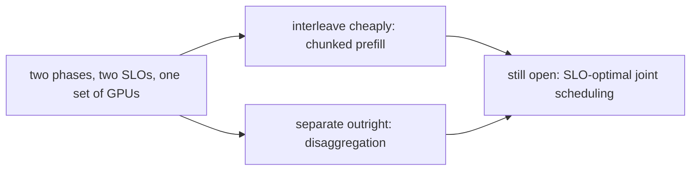

## The frontier and operating it per phase

**In brief.** Chunked prefill and disaggregation are two answers to one conflict — two phases, two SLOs,
one set of GPUs — and neither has solved the joint-SLO scheduling problem underneath. Once it is live,
the topic's cardinal rule carries straight into ops: **never collapse the two phases into one number.**

**Where the frontier is.**

- **Chunked prefill as the interleaving primitive (Sarathi).** Slice a long prompt's prefill into chunks and **interleave** them with ongoing decode so no single prefill monopolizes a step and spikes everyone's TPOT. This won and became a standard scheduling knob in vLLM and TensorRT-LLM — but it opened the harder question: **how big should a chunk be, and when should a decode step yield to a prefill chunk?**
- **Prefill and decode disaggregation (DistServe, Splitwise).** Both (2024) argue the phases have **opposite resource profiles** — prefill compute-bound, decode memory-bandwidth-bound — so co-locating them forces one shared scheduler to serve two workloads that optimize differently. Disaggregation puts them on **separate resource pools**, each scaled and scheduled for its own SLO, and **ships the KV state built during prefill over to the decode tier**. The nuance that aged in: it is **not free**. That KV transfer cost, plus bursty and imbalanced arrivals, means it pays off in **specific regimes — high, mixed load — not universally**. The live judgment is **when** to disaggregate, not whether it is always better.
- **The open problems.** Two the canon explicitly flags as unsolved. **SLO-optimal joint scheduling**: given per-request TTFT **and** TPOT targets, how do you order prefill chunks and decode steps to hit **both** — treating the two SLOs as a joint objective rather than tuning one and hoping the other holds? And **cross-phase interference**: when the phases share a GPU, a burst of prefill stalls decode. Disaggregation only **sidesteps** this by paying for separate hardware; the frontier is to **model and predict** the stall so a co-located scheduler can avoid it without the transfer tax.

**Signals to watch in production.**

- **TTFT percentiles (p50/p95/p99)** — the prefill-side SLO, set by prompt length and prefill scheduling. Watch the **tail**, not the mean: a rising TTFT p95 at a steady request rate points at prefill contention, not decode.
- **TPOT / ITL percentiles** — the decode-side SLO, what users feel as streaming smoothness. A TPOT p95 spike that **correlates with large prompts arriving** while TTFT stays flat is the signature of a **monolithic prefill stalling in-flight decode**: one big prefill occupies a whole GPU step while active decodes wait behind it. That is the exact problem chunked prefill exists to bound.
- **Prefill vs. decode queue depth** — track the two queues **separately**. A deep prefill queue with a shallow decode queue means you are prefill-bound and TTFT will slip; the reverse means decode-bound and TPOT will slip. One combined "pending requests" number hides which phase is the bottleneck and sends you to the wrong lever.
- **Batch composition** — prefill tokens vs. decode tokens per GPU step: the operational readout of your chunked-prefill tuning. Too much prefill per step starves decode and TPOT climbs; too little slows prompts through and TTFT climbs. It is the dial you actually turn to trade one SLO against the other.
- **SLO-attainment rate per phase** — the headline health metric, and what you alert and autoscale on: the fraction of requests meeting the TTFT target **and** the fraction meeting the TPOT target, reported separately. Two attainment numbers, not one.

**Why it matters.** Alert on per-phase SLO-attainment and the TTFT/TPOT tails, diagnose with per-phase
queue depth and batch composition to tell which phase is bound and why, and benchmark the two SLOs
separately (e.g. GenAI-Perf) — never reason about serving latency as a single number when the real
currency is **two phase-specific budgets**.
