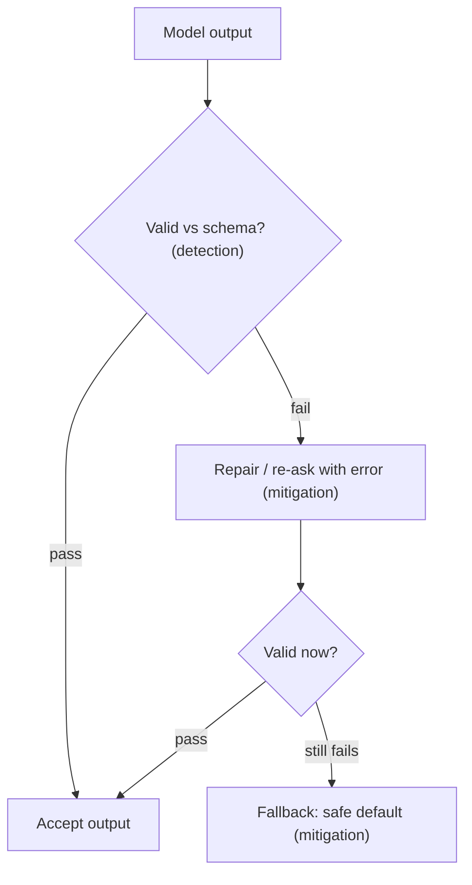

# Production failure modes — detection, mitigation, prevention

## Detection vs mitigation vs prevention

For every failure in the catalog, three distinct questions have three distinct answers. Confusing
them is a common interview trap.

- **Detection** — *did the failure happen?* Validators, freshness checks, and eval monitors that
  surface the problem.
- **Mitigation** — *now that it happened, how do we limit the blast radius?* Fallbacks, budgets, and
  circuit breakers that contain the damage after detection.
- **Prevention** — *how do we make it less likely in the first place?* Schemas, TTLs, and CI gates
  applied up front.

They are complementary, not substitutes. A mature system layers all three: prevention shrinks the
rate, detection catches what slips through, and mitigation keeps the escapes from hurting users.

## Handling malformed JSON: validate-repair-fallback

Malformed output is the clearest place to see the three layers in action. The canonical mitigation
pattern is **validate-repair-fallback**:

1. **Validate** the output against the schema (detection).
2. **Repair / re-ask** — if it fails, re-prompt the model, often feeding back the parse error, or
   repair the string (mitigation).
3. **Fallback** — if repair still fails, degrade to a safe default rather than crashing or shipping
   garbage downstream (mitigation).

Retrying the identical prompt forever is *not* the pattern — it neither repairs nor bounds cost. To
**prevent** malformed JSON in the first place, constrain generation with strict schemas or
constrained decoding so the model can't emit invalid output. Hallucinated tool calls follow the same
shape: validate the call against an allowlist/schema, re-ask on failure, and fall back to refusing
the action.

**Why it matters.** Detection, mitigation, and prevention are three different jobs; a system that
blurs them either over-reacts to noise or leaves silent gaps, so naming which one you're doing is
what turns a pile of guards into a reliable playbook.
