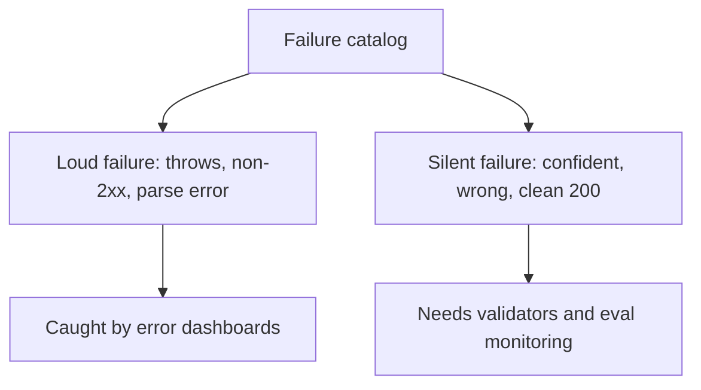

# Production failure modes — the failure catalog roadmap

## Roadmap: the failure catalog

**What this section covers.** The catalog of ways an LLM system fails in production that a plain web
service never does — and the single most important split: the *loud* failures that throw versus the
*silent* ones that return a confident, well-formed, wrong answer on a clean HTTP 200.

**The ideas you'll meet:**

- **Failure catalog** — the five model-layer failures worth memorizing, drawn from structured output, function calling, agents, and RAG.
- **Loud failure** — announces itself with an exception, a non-2xx status, or a parse error you can catch and alert on.
- **Silent failure** — a confident, well-formed, wrong answer behind a clean 200 that no error dashboard ever counts.
- **Hallucinated tool call** — the model invents a function, or arguments, that don't exist in the tool schema.
- **Stale retrieval** — a RAG answer grounded in documents that are out of date.
- **Runaway agent** — an agent loops or spends without bound, burning tokens and money.
- **Silent eval regression** — a prompt, model, or retrieval change quietly drops answer quality while nothing errors.

**Why it matters.** Everything downstream — detection, mitigation, prevention, and the guard suites
that implement them — exists because "our error rate is near zero" only speaks to the loud failures;
the ones that erode trust never move that number.
